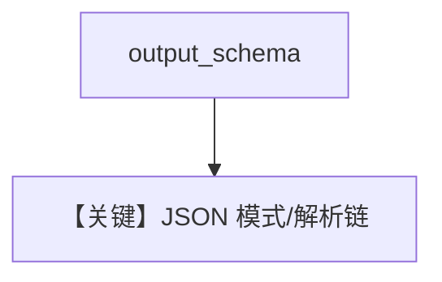

# structured_output.py — 实现原理分析

> 源文件：`cookbook/90_models/aws/claude/structured_output.py`

## 概述

**MovieScript + Aws Claude**。注意 `aws/claude.py` 将 **`supports_native_structured_outputs` 与 `supports_json_schema_outputs` 设为 False**（L52–53），更依赖 JSON 提示与解析路径。

**核心配置一览：**

| 配置项 | 值 | 说明 |
|--------|------|------|
| `model` | `Claude(id="global.anthropic.claude-sonnet-4-5-20250929-v1:0")` | Bedrock Claude |
| `description` | `"You help people write movie scripts."` | system |
| `output_schema` | `MovieScript` | 结构化 |

## System Prompt 组装

### 还原后的完整 System 文本（核心）

```text
You help people write movie scripts.
```

并含 `get_json_output_prompt` 等（`_messages.py` `# 3.3.15`），因 Bedrock Claude 关闭原生结构化标志。

## Mermaid 流程图



## 关键源码文件索引

| 文件 | 关键函数/类 | 作用 |
|------|------------|------|
| `agno/models/aws/claude.py` | `__post_init__` L51–53 | 关闭原生 structured |
