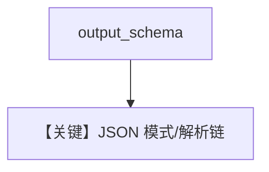

# structured_output.py — 实现原理分析

<!-- cookbook-py-source:start -->
## 完整源码

```python
"""
Aws Structured Output
=====================

Cookbook example for `aws/claude/structured_output.py`.
"""

from typing import List

from agno.agent import Agent, RunOutput  # noqa
from agno.models.aws import Claude
from pydantic import BaseModel, Field
from rich.pretty import pprint  # noqa

# ---------------------------------------------------------------------------
# Create Agent
# ---------------------------------------------------------------------------


class MovieScript(BaseModel):
    setting: str = Field(
        ..., description="Provide a nice setting for a blockbuster movie."
    )
    ending: str = Field(
        ...,
        description="Ending of the movie. If not available, provide a happy ending.",
    )
    genre: str = Field(
        ...,
        description="Genre of the movie. If not available, select action, thriller or romantic comedy.",
    )
    name: str = Field(..., description="Give a name to this movie")
    characters: List[str] = Field(..., description="Name of characters for this movie.")
    storyline: str = Field(
        ..., description="3 sentence storyline for the movie. Make it exciting!"
    )


movie_agent = Agent(
    model=Claude(id="global.anthropic.claude-sonnet-4-5-20250929-v1:0"),
    description="You help people write movie scripts.",
    output_schema=MovieScript,
)

# Get the response in a variable
# movie_agent: RunOutput = movie_agent.run("New York")
# pprint(movie_agent.content)

movie_agent.print_response("New York. Be brief.")

# ---------------------------------------------------------------------------
# Run Agent
# ---------------------------------------------------------------------------

if __name__ == "__main__":
    pass
```

<!-- cookbook-py-source:end -->

> 源文件：`cookbook/90_models/aws/claude/structured_output.py`

## 概述

**MovieScript + Aws Claude**。注意 `aws/claude.py` 将 **`supports_native_structured_outputs` 与 `supports_json_schema_outputs` 设为 False**（L52–53），更依赖 JSON 提示与解析路径。

**核心配置一览：**

| 配置项 | 值 | 说明 |
|--------|------|------|
| `model` | `Claude(id="global.anthropic.claude-sonnet-4-5-20250929-v1:0")` | Bedrock Claude |
| `description` | `"You help people write movie scripts."` | system |
| `output_schema` | `MovieScript` | 结构化 |

## System Prompt 组装

### 还原后的完整 System 文本（核心）

```text
You help people write movie scripts.
```

并含 `get_json_output_prompt` 等（`_messages.py` `# 3.3.15`），因 Bedrock Claude 关闭原生结构化标志。

## Mermaid 流程图



## 关键源码文件索引

| 文件 | 关键函数/类 | 作用 |
|------|------------|------|
| `agno/models/aws/claude.py` | `__post_init__` L51–53 | 关闭原生 structured |
