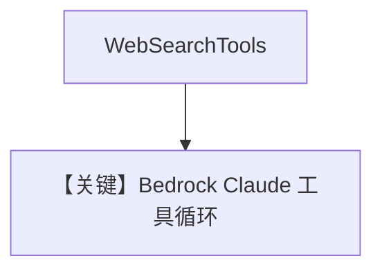

# tool_use.py — 实现原理分析

> 源文件：`cookbook/90_models/aws/claude/tool_use.py`

## 概述

**WebSearchTools + Aws Claude**，同步/流式/async 调用。

**核心配置一览：**

| 配置项 | 值 | 说明 |
|--------|------|------|
| `model` | `Claude(id="global.anthropic.claude-sonnet-4-5-20250929-v1:0")` | Bedrock |
| `tools` | `[WebSearchTools()]` | 搜索 |
| `markdown` | `True` | Markdown |

## System Prompt 组装

### 还原后的完整 System 文本

```text
Use markdown to format your answers.
```

## Mermaid 流程图



## 关键源码文件索引

| 文件 | 关键函数/类 | 作用 |
|------|------------|------|
| `agno/models/aws/claude.py` | `Claude` | 模型 |
