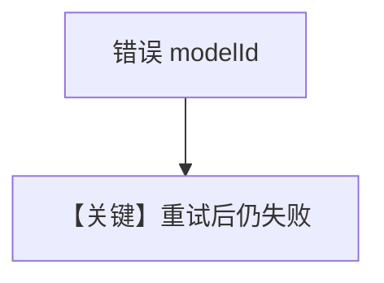

# retry.py — 实现原理分析

> 源文件：`cookbook/90_models/aws/retry.py`

## 概述

**AwsBedrock** 故意错误 `id` 与 **retries / delay / exponential_backoff**，演示模型层重试。

**核心配置一览：**

| 配置项 | 值 | 说明 |
|--------|------|------|
| `model` | `AwsBedrock(id="aws-bedrock-wrong-id", retries=3, ...)` | 重试 |

## 运行机制与因果链

与 `anthropic/retry.py` 相同意图，适配器为 **Converse**（`bedrock.py`）。

## System Prompt 组装

默认极短；运行时打印。

## Mermaid 流程图

## 关键源码文件索引

| 文件 | 关键函数/类 | 作用 |
|------|------------|------|
| `agno/models/aws/bedrock.py` | `invoke` | Converse |
