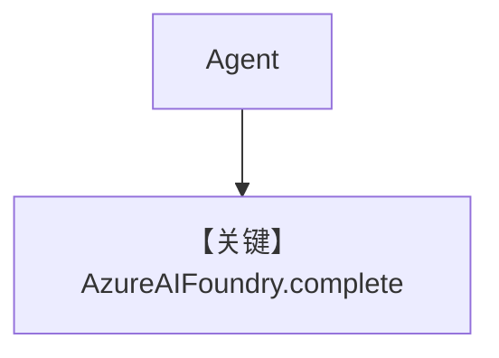

# basic.py — 实现原理分析

> 源文件：`cookbook/90_models/azure/ai_foundry/basic.py`

## 概述

本示例展示 **`AzureAIFoundry`**（`Phi-4`）与 **sync/stream/async** 调用；底层为 Azure AI **`complete`** API（`ai_foundry.py` L218）。

**核心配置一览：**

| 配置项 | 值 | 说明 |
|--------|------|------|
| `model` | `AzureAIFoundry(id="Phi-4")` | Azure AI Foundry |
| `markdown` | `True` | Markdown |

## 完整 API 请求

```python
# ai_foundry.py L218-221
# client.complete(messages=[...], **get_request_params(...))
```

## System Prompt 组装

### 还原后的完整 System 文本

```text
Use markdown to format your answers.
```

## Mermaid 流程图



## 关键源码文件索引

| 文件 | 关键函数/类 | 作用 |
|------|------------|------|
| `agno/models/azure/ai_foundry.py` | `invoke()` L203–226 | complete |
