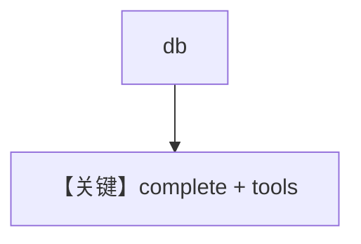

# db.py — 实现原理分析

> 源文件：`cookbook/90_models/azure/ai_foundry/db.py`

## 概述

**PostgresDb + AzureAIFoundry(Phi-4) + WebSearchTools + 历史**。

**核心配置一览：**

| 配置项 | 值 | 说明 |
|--------|------|------|
| `model` | `AzureAIFoundry(id="Phi-4")` | Foundry |
| `db` | `PostgresDb(...)` | 持久化 |
| `tools` | `[WebSearchTools()]` | 搜索 |
| `add_history_to_context` | `True` | 历史 |

## System Prompt 组装

默认无 instructions；markdown 默认 True 时含 Markdown 段。

## Mermaid 流程图

## 关键源码文件索引

| 文件 | 关键函数/类 | 作用 |
|------|------------|------|
| `agno/models/azure/ai_foundry.py` | `invoke()` | API |
