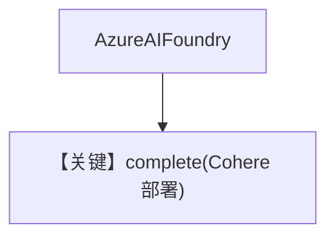

# demo_cohere.py — 实现原理分析

<!-- cookbook-py-source:start -->
## 完整源码

```python
"""
Azure Demo Cohere
=================

Cookbook example for `azure/ai_foundry/demo_cohere.py`.
"""

from agno.agent import Agent, RunOutput  # noqa
from agno.models.azure import AzureAIFoundry

# ---------------------------------------------------------------------------
# Create Agent
# ---------------------------------------------------------------------------

agent = Agent(model=AzureAIFoundry(id="Cohere-command-r-08-2024"), markdown=True)

# Get the response in a variable
# run: RunOutput = agent.run("Share a 2 sentence horror story")
# print(run.content)

# Print the response on the terminal
agent.print_response("Share a 2 sentence horror story")

# ---------------------------------------------------------------------------
# Run Agent
# ---------------------------------------------------------------------------

if __name__ == "__main__":
    pass
```

<!-- cookbook-py-source:end -->

> 源文件：`cookbook/90_models/azure/ai_foundry/demo_cohere.py`

## 概述

在 **Azure AI Foundry** 上使用部署名 **`Cohere-command-r-08-2024`**（托管 Cohere 模型）。

**核心配置一览：**

| 配置项 | 值 | 说明 |
|--------|------|------|
| `model` | `AzureAIFoundry(id="Cohere-command-r-08-2024")` | Cohere via Foundry |
| `markdown` | `True` | Markdown |

## 运行机制与因果链

与 `Phi-4` 相同调用链，仅 `id` 换为 Cohere 部署。

## System Prompt 组装

### 还原后的完整 System 文本

```text
Use markdown to format your answers.
```

## Mermaid 流程图



## 关键源码文件索引

| 文件 | 关键函数/类 | 作用 |
|------|------------|------|
| `agno/models/azure/ai_foundry.py` | `AzureAIFoundry` | 统一入口 |
