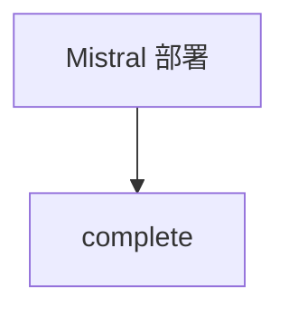

# demo_mistral.py — 实现原理分析

<!-- cookbook-py-source:start -->
## 完整源码

```python
"""
Azure Demo Mistral
==================

Cookbook example for `azure/ai_foundry/demo_mistral.py`.
"""

from agno.agent import Agent, RunOutput  # noqa
from agno.models.azure import AzureAIFoundry

# ---------------------------------------------------------------------------
# Create Agent
# ---------------------------------------------------------------------------

agent = Agent(model=AzureAIFoundry(id="Mistral-Large-2411"), markdown=True)

# Get the response in a variable
# run: RunOutput = agent.run("Share a 2 sentence horror story")
# print(run.content)

# Print the response on the terminal
agent.print_response("Share a 2 sentence horror story")

# ---------------------------------------------------------------------------
# Run Agent
# ---------------------------------------------------------------------------

if __name__ == "__main__":
    pass
```

<!-- cookbook-py-source:end -->

> 源文件：`cookbook/90_models/azure/ai_foundry/demo_mistral.py`

## 概述

**AzureAIFoundry(id="Mistral-Large-2411")**，演示 Foundry 上 Mistral 部署。

**核心配置一览：**

| 配置项 | 值 | 说明 |
|--------|------|------|
| `model` | `AzureAIFoundry(id="Mistral-Large-2411")` | Mistral |
| `markdown` | `True` | Markdown |

## System Prompt 组装

### 还原后的完整 System 文本

```text
Use markdown to format your answers.
```

## Mermaid 流程图



## 关键源码文件索引

| 文件 | 关键函数/类 | 作用 |
|------|------------|------|
| `agno/models/azure/ai_foundry.py` | `invoke()` | 同上 |
