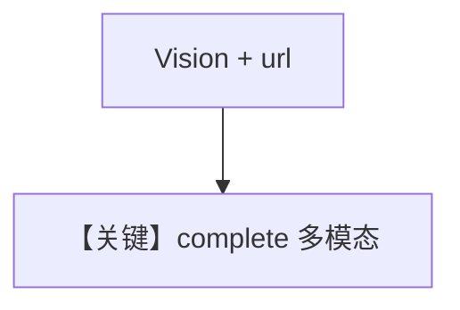

# image_agent.py — 实现原理分析

> 源文件：`cookbook/90_models/azure/ai_foundry/image_agent.py`

## 概述

**Llama-3.2-11B-Vision-Instruct** 与 **Image URL**、`detail="high"`，流式输出。

**核心配置一览：**

| 配置项 | 值 | 说明 |
|--------|------|------|
| `model` | `AzureAIFoundry(id="Llama-3.2-11B-Vision-Instruct")` | 视觉 |
| `markdown` | `True` | Markdown |
| `images` | `Image(url=..., detail="high")` | 高细节 |

## Mermaid 流程图

## 关键源码文件索引

| 文件 | 关键函数/类 | 作用 |
|------|------------|------|
| `agno/models/azure/ai_foundry.py` | `format_message` | 媒体格式化 |
