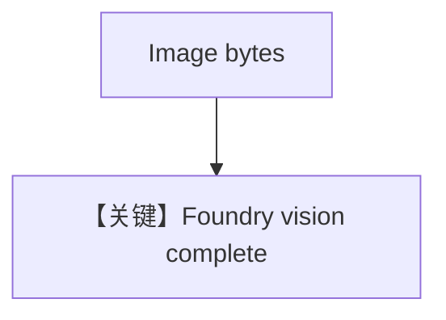

# image_agent_bytes.py — 实现原理分析

<!-- cookbook-py-source:start -->
## 完整源码

```python
"""
Azure Image Agent Bytes
=======================

Cookbook example for `azure/ai_foundry/image_agent_bytes.py`.
"""

from pathlib import Path

from agno.agent import Agent
from agno.media import Image
from agno.models.azure import AzureAIFoundry
from agno.utils.media import download_image

# ---------------------------------------------------------------------------
# Create Agent
# ---------------------------------------------------------------------------

agent = Agent(
    model=AzureAIFoundry(id="Llama-3.2-11B-Vision-Instruct"),
    markdown=True,
)

image_path = Path(__file__).parent.joinpath("sample.jpg")

download_image(
    url="https://upload.wikimedia.org/wikipedia/commons/0/0c/GoldenGateBridge-001.jpg",
    output_path=str(image_path),
)

# Read the image file content as bytes
image_bytes = image_path.read_bytes()

agent.print_response(
    "Tell me about this image.",
    images=[
        Image(content=image_bytes),
    ],
    stream=True,
)

# ---------------------------------------------------------------------------
# Run Agent
# ---------------------------------------------------------------------------

if __name__ == "__main__":
    pass
```

<!-- cookbook-py-source:end -->

> 源文件：`cookbook/90_models/azure/ai_foundry/image_agent_bytes.py`

## 概述

**Image(content=bytes)** 与 **Llama-3.2-11B-Vision-Instruct**。

**核心配置一览：**

| 配置项 | 值 | 说明 |
|--------|------|------|
| `model` | `AzureAIFoundry(id="Llama-3.2-11B-Vision-Instruct")` | Vision |
| `markdown` | `True` | Markdown |
| `images` | `Image(content=image_bytes)` | 字节 |

## System Prompt 组装

### 还原后的完整 System 文本

```text
Use markdown to format your answers.
```

## Mermaid 流程图



## 关键源码文件索引

| 文件 | 关键函数/类 | 作用 |
|------|------------|------|
| `agno/models/azure/ai_foundry.py` | `invoke()` | complete |
