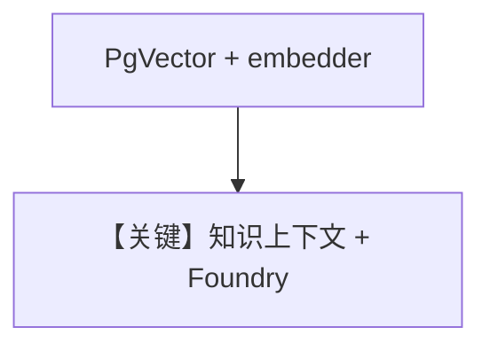

# knowledge.py — 实现原理分析

> 源文件：`cookbook/90_models/azure/ai_foundry/knowledge.py`

## 概述

**Knowledge + PgVector + AzureOpenAIEmbedder + AzureAIFoundry(Cohere-command-r)**，RAG 与聊天均经 Foundry。

**核心配置一览：**

| 配置项 | 值 | 说明 |
|--------|------|------|
| `model` | `AzureAIFoundry(id="Cohere-command-r-08-2024")` | 生成 |
| `knowledge` | `Knowledge(..., embedder=AzureOpenAIEmbedder())` | 检索 |

## System Prompt 组装

默认 `search_knowledge=True` 时注入知识说明；检索正文动态。

## Mermaid 流程图

## 关键源码文件索引

| 文件 | 关键函数/类 | 作用 |
|------|------------|------|
| `agno/agent/_messages.py` | `# 3.3.13` | 知识 |
| `agno/models/azure/ai_foundry.py` | `invoke()` | complete |
