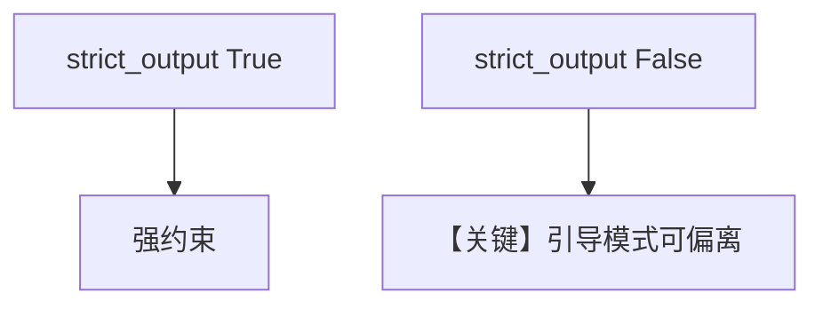

# structured_output.py — 实现原理分析

<!-- cookbook-py-source:start -->
## 完整源码

```python
"""
Azure Structured Output
=======================

Cookbook example for `azure/ai_foundry/structured_output.py`.
"""

from typing import List

from agno.agent import Agent, RunOutput  # noqa
from agno.models.azure import AzureAIFoundry
from pydantic import BaseModel, Field
from rich.pretty import pprint  # noqa

# ---------------------------------------------------------------------------
# Create Agent
# ---------------------------------------------------------------------------


class MovieScript(BaseModel):
    setting: str = Field(
        ..., description="Provide a nice setting for a blockbuster movie."
    )
    ending: str = Field(
        ...,
        description="Ending of the movie. If not available, provide a happy ending.",
    )
    genre: str = Field(
        ...,
        description="Genre of the movie. If not available, select action, thriller or romantic comedy.",
    )
    name: str = Field(..., description="Give a name to this movie")
    characters: List[str] = Field(..., description="Name of characters for this movie.")
    storyline: str = Field(
        ..., description="3 sentence storyline for the movie. Make it exciting!"
    )


# Agent that uses structured outputs with strict_output=True (default)
structured_output_agent = Agent(
    model=AzureAIFoundry(id="gpt-4o"),
    description="You write movie scripts.",
    output_schema=MovieScript,
)

# Agent with strict_output=False (guided mode)
# strict_output=False: Attempts to follow the schema as a guide but may occasionally deviate
guided_output_agent = Agent(
    model=AzureAIFoundry(id="gpt-4o", strict_output=False),
    description="You write movie scripts.",
    output_schema=MovieScript,
)

# Get the response in a variable
# structured_output_response: RunOutput = structured_output_agent.run("New York")
# pprint(structured_output_response.content)

structured_output_agent.print_response("New York")
guided_output_agent.print_response("New York")

# ---------------------------------------------------------------------------
# Run Agent
# ---------------------------------------------------------------------------

if __name__ == "__main__":
    pass
```

<!-- cookbook-py-source:end -->

> 源文件：`cookbook/90_models/azure/ai_foundry/structured_output.py`

## 概述

**两个 Agent**：`strict_output=True`（默认）与 **`strict_output=False`** 的 `AzureAIFoundry(gpt-4o)`，对比结构化强度。

**核心配置一览：**

| 配置项 | 值 | 说明 |
|--------|------|------|
| `structured_output_agent` | `AzureAIFoundry(id="gpt-4o"), output_schema=MovieScript` | 严格 |
| `guided_output_agent` | `AzureAIFoundry(id="gpt-4o", strict_output=False), ...` | 引导模式 |
| `description` | `"You write movie scripts."` | system |

## System Prompt 组装

### 还原后的完整 System 文本（description）

```text
You write movie scripts.
```

## Mermaid 流程图



## 关键源码文件索引

| 文件 | 关键函数/类 | 作用 |
|------|------------|------|
| `agno/models/azure/ai_foundry.py` | `get_request_params` | strict_output |
