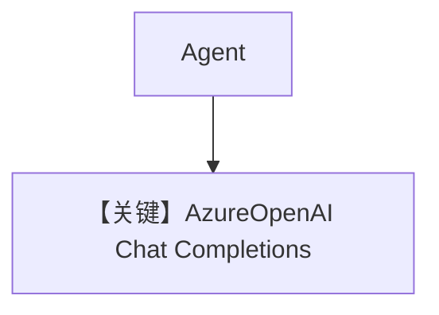

# basic.py — 实现原理分析

<!-- cookbook-py-source:start -->
## 完整源码

```python
"""
Azure Basic
===========

Cookbook example for `azure/openai/basic.py`.
"""

from agno.agent import Agent, RunOutput  # noqa
from agno.models.azure import AzureOpenAI
import asyncio

# ---------------------------------------------------------------------------
# Create Agent
# ---------------------------------------------------------------------------

agent = Agent(model=AzureOpenAI(id="gpt-5.2"), markdown=True)

# Get the response in a variable
# run: RunOutput = agent.run("Share a 2 sentence horror story")
# print(run.content)

# Print the response on the terminal

# ---------------------------------------------------------------------------
# Run Agent
# ---------------------------------------------------------------------------
if __name__ == "__main__":
    # --- Sync ---
    agent.print_response("Share a 2 sentence horror story")

    # --- Sync + Streaming ---
    agent.print_response("Share a 2 sentence horror story", stream=True)

    # --- Async ---
    asyncio.run(agent.aprint_response("Share a breakfast recipe.", markdown=True))

    # --- Async + Streaming ---
    asyncio.run(
        agent.aprint_response("Share a breakfast recipe.", markdown=True, stream=True)
    )
```

<!-- cookbook-py-source:end -->

> 源文件：`cookbook/90_models/azure/openai/basic.py`

## 概述

本示例展示 **`AzureOpenAI`**（继承 **`OpenAILike`**）与 **`gpt-5.2`** 部署，走 Azure OpenAI **Chat Completions** 兼容接口。

**核心配置一览：**

| 配置项 | 值 | 说明 |
|--------|------|------|
| `model` | `AzureOpenAI(id="gpt-5.2")` | Azure 部署名 |
| `markdown` | `True` | Markdown |

## 完整 API 请求

```python
# OpenAILike: chat.completions.create(messages=[...], model=deployment, ...)
```

## System Prompt 组装

### 还原后的完整 System 文本

```text
Use markdown to format your answers.
```

## Mermaid 流程图



## 关键源码文件索引

| 文件 | 关键函数/类 | 作用 |
|------|------------|------|
| `agno/models/azure/openai_chat.py` | `AzureOpenAI` | 客户端 |
| `agno/models/openai/like.py` | `OpenAILike` | invoke |
