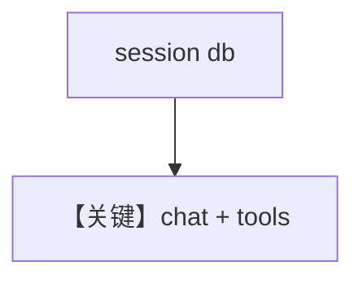

# db.py — 实现原理分析

> 源文件：`cookbook/90_models/azure/openai/db.py`

## 概述

**PostgresDb + AzureOpenAI(gpt-5.2) + WebSearchTools + 历史**。

**核心配置一览：**

| 配置项 | 值 | 说明 |
|--------|------|------|
| `model` | `AzureOpenAI(id="gpt-5.2")` | Azure |
| `db` | `PostgresDb(...)` | 持久化 |
| `tools` | `[WebSearchTools()]` | 搜索 |
| `add_history_to_context` | `True` | 历史 |

## System Prompt 组装

默认无自定义 instructions。

## Mermaid 流程图

## 关键源码文件索引

| 文件 | 关键函数/类 | 作用 |
|------|------------|------|
| `agno/models/azure/openai_chat.py` | `AzureOpenAI` | 认证与 endpoint |
