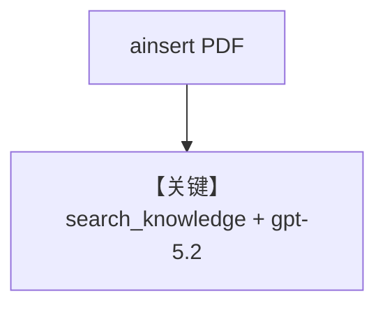

# knowledge.py — 实现原理分析

<!-- cookbook-py-source:start -->
## 完整源码

```python
"""Run `uv pip install ddgs sqlalchemy pgvector pypdf openai` to install dependencies."""

import asyncio

from agno.agent import Agent
from agno.knowledge.embedder.azure_openai import AzureOpenAIEmbedder
from agno.knowledge.knowledge import Knowledge
from agno.models.azure import AzureOpenAI
from agno.vectordb.pgvector import PgVector

# ---------------------------------------------------------------------------
# Create Agent
# ---------------------------------------------------------------------------

db_url = "postgresql+psycopg://ai:ai@localhost:5532/ai"

knowledge = Knowledge(
    vector_db=PgVector(
        table_name="recipes",
        db_url=db_url,
        embedder=AzureOpenAIEmbedder(),
    ),
)
# Add content to the knowledge
asyncio.run(
    knowledge.ainsert(
        url="https://agno-public.s3.amazonaws.com/recipes/ThaiRecipes.pdf"
    )
)

agent = Agent(
    model=AzureOpenAI(id="gpt-5.2"),
    knowledge=knowledge,
)
agent.print_response("How to make Thai curry?", markdown=True)

# ---------------------------------------------------------------------------
# Run Agent
# ---------------------------------------------------------------------------

if __name__ == "__main__":
    pass
```

<!-- cookbook-py-source:end -->

> 源文件：`cookbook/90_models/azure/openai/knowledge.py`

## 概述

**异步 `knowledge.ainsert`** 写入 PDF，**AzureOpenAI(gpt-5.2)** 回答问题，嵌入为 **AzureOpenAIEmbedder**。

**核心配置一览：**

| 配置项 | 值 | 说明 |
|--------|------|------|
| `model` | `AzureOpenAI(id="gpt-5.2")` | 生成 |
| `knowledge` | `Knowledge(..., embedder=AzureOpenAIEmbedder())` | RAG |

## 运行机制与因果链

`asyncio.run(knowledge.ainsert(...))` 在同步脚本中触发异步入库。

## Mermaid 流程图



## 关键源码文件索引

| 文件 | 关键函数/类 | 作用 |
|------|------------|------|
| `agno/knowledge/knowledge.py` | `ainsert` | 异步入库 |
