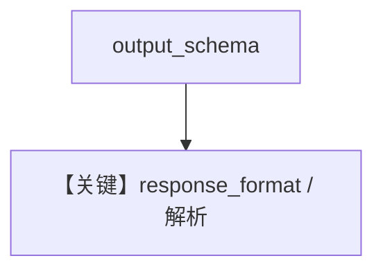

# structured_output.py — 实现原理分析

> 源文件：`cookbook/90_models/azure/openai/structured_output.py`

## 概述

**AzureOpenAI(gpt-5.2) + MovieScript**，同步 `run` + `pprint`。

**核心配置一览：**

| 配置项 | 值 | 说明 |
|--------|------|------|
| `model` | `AzureOpenAI(id="gpt-5.2")` | 支持原生结构化（类级标志） |
| `description` | `"You help people write movie scripts."` | system |
| `output_schema` | `MovieScript` | 结构化 |

## System Prompt 组装

### 还原后的完整 System 文本（核心）

```text
You help people write movie scripts.
```

## Mermaid 流程图



## 关键源码文件索引

| 文件 | 关键函数/类 | 作用 |
|------|------------|------|
| `agno/models/azure/openai_chat.py` | `AzureOpenAI` | `supports_native_structured_outputs` |
