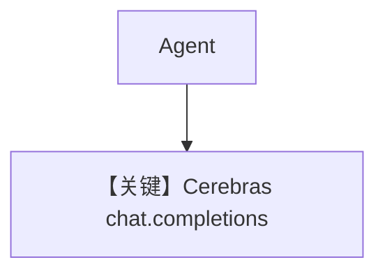

# basic.py — 实现原理分析

> 源文件：`cookbook/90_models/cerebras/basic.py`

## 概述

本示例展示 **`Cerebras`**（`llama-3.3-70b`）与 **sync/stream/async** `print_response`。

**核心配置一览：**

| 配置项 | 值 | 说明 |
|--------|------|------|
| `model` | `Cerebras(id="llama-3.3-70b")` | Cerebras 原生 SDK |
| `markdown` | `True` | Markdown |

## 完整 API 请求

```python
# cerebras.py L259-262
# client.chat.completions.create(model=..., messages=..., **get_request_params(...))
```

## System Prompt 组装

### 还原后的完整 System 文本

```text
Use markdown to format your answers.
```

## Mermaid 流程图



## 关键源码文件索引

| 文件 | 关键函数/类 | 作用 |
|------|------------|------|
| `agno/models/cerebras/cerebras.py` | `invoke()` L239–268 | create |
