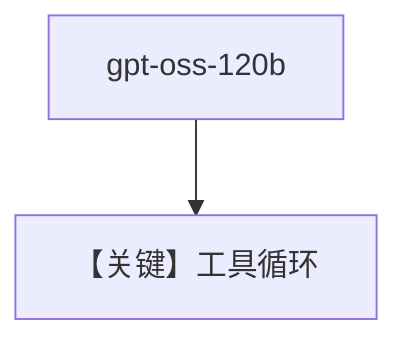

# oss_gpt.py — 实现原理分析

<!-- cookbook-py-source:start -->
## 完整源码

```python
"""
Cerebras Oss Gpt
================

Cookbook example for `cerebras/oss_gpt.py`.
"""

from agno.agent.agent import Agent
from agno.models.cerebras.cerebras import Cerebras
from agno.tools.websearch import WebSearchTools

# ---------------------------------------------------------------------------
# Create Agent
# ---------------------------------------------------------------------------

agent = Agent(
    model=Cerebras(
        id="gpt-oss-120b",
    ),
    tools=[WebSearchTools()],
    markdown=True,
)

# Print the response in the terminal
agent.print_response("Whats happening in France?")

# ---------------------------------------------------------------------------
# Run Agent
# ---------------------------------------------------------------------------

if __name__ == "__main__":
    pass
```

<!-- cookbook-py-source:end -->

> 源文件：`cookbook/90_models/cerebras/oss_gpt.py`

## 概述

**Cerebras** 使用 **`gpt-oss-120b`** 与 **WebSearchTools**，演示 OSS GPT 类模型在 Cerebras 上的工具调用。

**核心配置一览：**

| 配置项 | 值 | 说明 |
|--------|------|------|
| `model` | `Cerebras(id="gpt-oss-120b")` | OSS GPT |
| `tools` | `[WebSearchTools()]` | 搜索 |
| `markdown` | `True` | Markdown |

## Mermaid 流程图



## 关键源码文件索引

| 文件 | 关键函数/类 | 作用 |
|------|------------|------|
| `agno/models/cerebras/cerebras.py` | `get_request_params` | tools |
