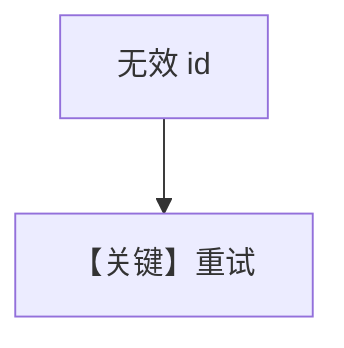

# retry.py — 实现原理分析

> 源文件：`cookbook/90_models/cerebras/retry.py`

## 概述

**Cerebras** 错误 model id + **retries / delay / exponential_backoff**。

**核心配置一览：**

| 配置项 | 值 | 说明 |
|--------|------|------|
| `model` | `Cerebras(id="cerebras-wrong-id", retries=3, ...)` | 重试 |

## Mermaid 流程图

## 关键源码文件索引

| 文件 | 关键函数/类 | 作用 |
|------|------------|------|
| `agno/models/cerebras/cerebras.py` | `invoke` | 错误传播 |
