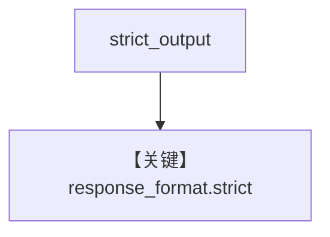

# structured_output.py — 实现原理分析

<!-- cookbook-py-source:start -->
## 完整源码

```python
"""
Cerebras Structured Output
==========================

Cookbook example for `cerebras/structured_output.py`.
"""

from typing import List

from agno.agent import Agent, RunOutput  # noqa
from agno.models.cerebras import Cerebras
from pydantic import BaseModel, Field
from rich.pretty import pprint  # noqa

# ---------------------------------------------------------------------------
# Create Agent
# ---------------------------------------------------------------------------


class MovieScript(BaseModel):
    setting: str = Field(
        ..., description="Provide a nice setting for a blockbuster movie."
    )
    ending: str = Field(
        ...,
        description="Ending of the movie. If not available, provide a happy ending.",
    )
    genre: str = Field(
        ...,
        description="Genre of the movie. If not available, select action, thriller or romantic comedy.",
    )
    name: str = Field(..., description="Give a name to this movie")
    characters: List[str] = Field(..., description="Name of characters for this movie.")
    storyline: str = Field(
        ..., description="3 sentence storyline for the movie. Make it exciting!"
    )


# Agent that uses structured outputs with strict_output=True (default)
structured_output_agent = Agent(
    model=Cerebras(id="qwen-3-32b"),
    description="You write movie scripts.",
    output_schema=MovieScript,
)

# Agent with strict_output=False (guided mode)
guided_output_agent = Agent(
    model=Cerebras(id="qwen-3-32b", strict_output=False),
    description="You write movie scripts.",
    output_schema=MovieScript,
)

# Get the response in a variable
# structured_output_response: RunOutput = structured_output_agent.run("New York")
# pprint(structured_output_response.content)

structured_output_agent.print_response("New York")
guided_output_agent.print_response("New York")

# ---------------------------------------------------------------------------
# Run Agent
# ---------------------------------------------------------------------------

if __name__ == "__main__":
    pass
```

<!-- cookbook-py-source:end -->

> 源文件：`cookbook/90_models/cerebras/structured_output.py`

## 概述

**两个 Agent**：`qwen-3-32b` 上 **`strict_output` 默认** 与 **`strict_output=False`** 的对比（`get_request_params` 内处理 `response_format`，见 `cerebras.py` L220–229 附近）。

**核心配置一览：**

| 配置项 | 值 | 说明 |
|--------|------|------|
| `structured_output_agent` | `Cerebras(id="qwen-3-32b"), output_schema=MovieScript` | 严格 JSON schema |
| `guided_output_agent` | `Cerebras(id="qwen-3-32b", strict_output=False)` | 引导 |
| `description` | `"You write movie scripts."` | system |

## System Prompt 组装

### 还原后的完整 System 文本（description）

```text
You write movie scripts.
```

## Mermaid 流程图



## 关键源码文件索引

| 文件 | 关键函数/类 | 作用 |
|------|------------|------|
| `agno/models/cerebras/cerebras.py` | `get_request_params` | schema / strict |
