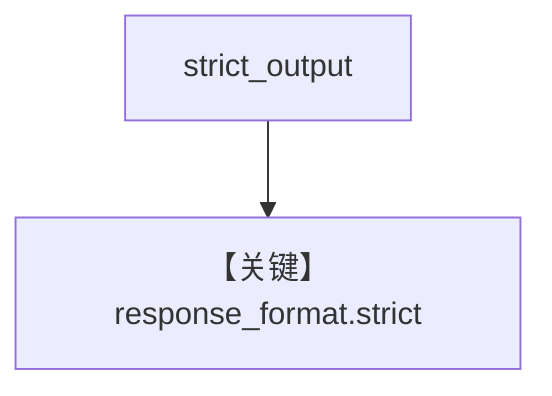

# structured_output.py — 实现原理分析

> 源文件：`cookbook/90_models/cerebras/structured_output.py`

## 概述

**两个 Agent**：`qwen-3-32b` 上 **`strict_output` 默认** 与 **`strict_output=False`** 的对比（`get_request_params` 内处理 `response_format`，见 `cerebras.py` L220–229 附近）。

**核心配置一览：**

| 配置项 | 值 | 说明 |
|--------|------|------|
| `structured_output_agent` | `Cerebras(id="qwen-3-32b"), output_schema=MovieScript` | 严格 JSON schema |
| `guided_output_agent` | `Cerebras(id="qwen-3-32b", strict_output=False)` | 引导 |
| `description` | `"You write movie scripts."` | system |

## System Prompt 组装

### 还原后的完整 System 文本（description）

```text
You write movie scripts.
```

## Mermaid 流程图



## 关键源码文件索引

| 文件 | 关键函数/类 | 作用 |
|------|------------|------|
| `agno/models/cerebras/cerebras.py` | `get_request_params` | schema / strict |
