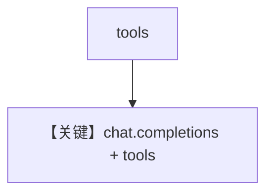

# tool_use.py — 实现原理分析

<!-- cookbook-py-source:start -->
## 完整源码

```python
"""
Cerebras Tool Use
=================

Cookbook example for `cerebras/tool_use.py`.
"""

import asyncio

from agno.agent import Agent
from agno.models.cerebras import Cerebras
from agno.tools.websearch import WebSearchTools

# ---------------------------------------------------------------------------
# Create Agent
# ---------------------------------------------------------------------------

agent = Agent(
    model=Cerebras(id="llama-3.3-70b"),
    tools=[WebSearchTools()],
    markdown=True,
)

# Print the response in the terminal

# ---------------------------------------------------------------------------
# Run Agent
# ---------------------------------------------------------------------------
if __name__ == "__main__":
    # --- Sync ---
    agent.print_response("Whats happening in France?")

    # --- Sync + Streaming ---
    agent.print_response("Whats happening in France?", stream=True)

    # --- Async ---
    asyncio.run(agent.aprint_response("Whats happening in France?"))

    # --- Async + Streaming ---
    asyncio.run(agent.aprint_response("Whats happening in France?", stream=True))
```

<!-- cookbook-py-source:end -->

> 源文件：`cookbook/90_models/cerebras/tool_use.py`

## 概述

**Cerebras + WebSearchTools**，全模式 `print_response`。

**核心配置一览：**

| 配置项 | 值 | 说明 |
|--------|------|------|
| `model` | `Cerebras(id="llama-3.3-70b")` | Cerebras |
| `tools` | `[WebSearchTools()]` | 搜索 |
| `markdown` | `True` | Markdown |

## System Prompt 组装

### 还原后的完整 System 文本

```text
Use markdown to format your answers.
```

## Mermaid 流程图



## 关键源码文件索引

| 文件 | 关键函数/类 | 作用 |
|------|------------|------|
| `agno/models/cerebras/cerebras.py` | `invoke()` L239+ | create |
