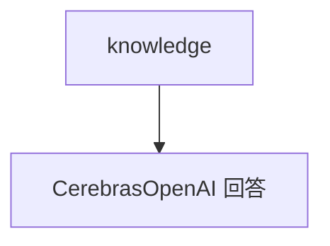

# knowledge.py — 实现原理分析

> 源文件：`cookbook/90_models/cerebras_openai/knowledge.py`

## 概述

**Knowledge + PgVector + CerebrasOpenAI**，同步 `knowledge.insert`。

**核心配置一览：**

| 配置项 | 值 | 说明 |
|--------|------|------|
| `model` | `CerebrasOpenAI(id="llama-4-scout-17b-16e-instruct")` | 生成 |
| `knowledge` | `Knowledge(...)` | RAG |

## Mermaid 流程图

## 关键源码文件索引

| 文件 | 关键函数/类 | 作用 |
|------|------------|------|
| `agno/knowledge/knowledge.py` | `insert` | 入库 |
