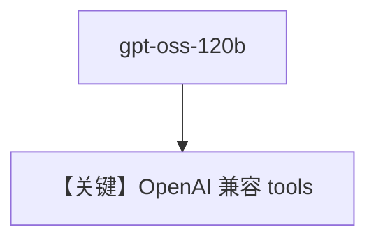

# oss_gpt.py — 实现原理分析

> 源文件：`cookbook/90_models/cerebras_openai/oss_gpt.py`

## 概述

**CerebrasOpenAI + gpt-oss-120b + WebSearchTools**（OpenAI 兼容路径）。

**核心配置一览：**

| 配置项 | 值 | 说明 |
|--------|------|------|
| `model` | `CerebrasOpenAI(id="gpt-oss-120b")` | OSS GPT |
| `tools` | `[WebSearchTools()]` | 搜索 |
| `markdown` | `True` | Markdown |

## Mermaid 流程图

## 关键源码文件索引

| 文件 | 关键函数/类 | 作用 |
|------|------------|------|
| `agno/models/cerebras/cerebras_openai.py` | `get_request_params` | tools 格式 |
