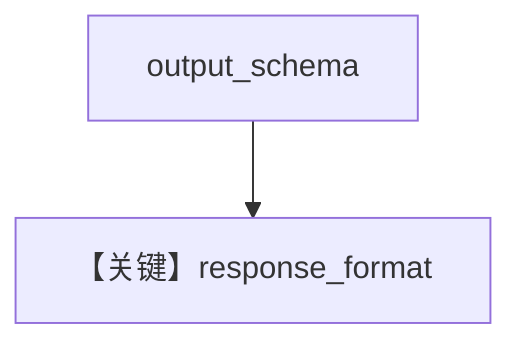

# structured_output.py — 实现原理分析

<!-- cookbook-py-source:start -->
## 完整源码

```python
"""
Cerebras Openai Structured Output
=================================

Cookbook example for `cerebras_openai/structured_output.py`.
"""

from typing import List

from agno.agent import Agent, RunOutput  # noqa
from agno.models.cerebras import CerebrasOpenAI
from pydantic import BaseModel, Field
from rich.pretty import pprint  # noqa

# ---------------------------------------------------------------------------
# Create Agent
# ---------------------------------------------------------------------------


class MovieScript(BaseModel):
    setting: str = Field(
        ..., description="Provide a nice setting for a blockbuster movie."
    )
    ending: str = Field(
        ...,
        description="Ending of the movie. If not available, provide a happy ending.",
    )
    genre: str = Field(
        ...,
        description="Genre of the movie. If not available, select action, thriller or romantic comedy.",
    )
    name: str = Field(..., description="Give a name to this movie")
    characters: List[str] = Field(..., description="Name of characters for this movie.")
    storyline: str = Field(
        ..., description="3 sentence storyline for the movie. Make it exciting!"
    )


# Agent that uses a structured output
structured_output_agent = Agent(
    model=CerebrasOpenAI(id="llama-4-scout-17b-16e-instruct"),
    description="You are a helpful assistant. Summarize the movie script based on the location in a JSON object.",
    output_schema=MovieScript,
)

structured_output_agent.print_response("New York")

# ---------------------------------------------------------------------------
# Run Agent
# ---------------------------------------------------------------------------

if __name__ == "__main__":
    pass
```

<!-- cookbook-py-source:end -->

> 源文件：`cookbook/90_models/cerebras_openai/structured_output.py`

## 概述

**CerebrasOpenAI + MovieScript**，`description` 文案强调 JSON 摘要。

**核心配置一览：**

| 配置项 | 值 | 说明 |
|--------|------|------|
| `model` | `CerebrasOpenAI(id="llama-4-scout-17b-16e-instruct")` | OpenAI 兼容 |
| `description` | `"You are a helpful assistant. Summarize the movie script based on the location in a JSON object."` | system |
| `output_schema` | `MovieScript` | 结构化 |

## System Prompt 组装

### 还原后的完整 System 文本（description 原样）

```text
You are a helpful assistant. Summarize the movie script based on the location in a JSON object.
```

## Mermaid 流程图



## 关键源码文件索引

| 文件 | 关键函数/类 | 作用 |
|------|------------|------|
| `agno/models/openai/like.py` | `get_request_params` | 结构化 |
