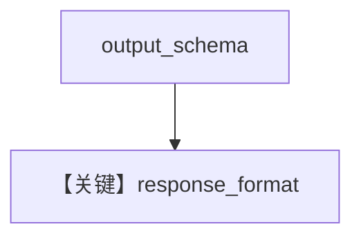

# structured_output.py — 实现原理分析

> 源文件：`cookbook/90_models/cerebras_openai/structured_output.py`

## 概述

**CerebrasOpenAI + MovieScript**，`description` 文案强调 JSON 摘要。

**核心配置一览：**

| 配置项 | 值 | 说明 |
|--------|------|------|
| `model` | `CerebrasOpenAI(id="llama-4-scout-17b-16e-instruct")` | OpenAI 兼容 |
| `description` | `"You are a helpful assistant. Summarize the movie script based on the location in a JSON object."` | system |
| `output_schema` | `MovieScript` | 结构化 |

## System Prompt 组装

### 还原后的完整 System 文本（description 原样）

```text
You are a helpful assistant. Summarize the movie script based on the location in a JSON object.
```

## Mermaid 流程图



## 关键源码文件索引

| 文件 | 关键函数/类 | 作用 |
|------|------------|------|
| `agno/models/openai/like.py` | `get_request_params` | 结构化 |
