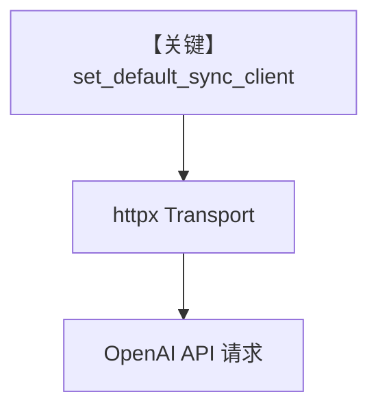

# http_client_caching.py — 实现原理分析

> 源文件：`cookbook/90_models/clients/http_client_caching.py`

## 概述

本示例展示 **`set_default_sync_client`**（`agno.utils.http`）注入全局 **`httpx.Client`**，使 **OpenAIChat** 等模型共用自定义 **Transport**（请求 ID、公司头、生产组合），并打开 **logging.DEBUG** 观察 httpx 行为。

**核心配置一览：**

| 配置项 | 值 | 说明 |
|--------|------|------|
| `model` | `OpenAIChat(id="gpt-5.2")` | 依赖 httpx 的 OpenAI 客户端 |
| `name` | `"Request-ID Agent"` / `"Header Agent"` / `"Prod OpenAI"` | 多段脚本中重复赋值 `agent` |

本文件**不是**单一 Agent 演示，而是**三段**依次 `set_default_sync_client` 并 `agent.run(...)`。

## 核心组件解析

### 全局 httpx 客户端

所有使用默认同步 http 客户端的模型请求会经过当前设置的 `httpx.Client`；后一段示例会**覆盖**前一段的 default client。

### 运行机制与因果链

1. **路径**：`set_default_sync_client` → OpenAI SDK → 共用 Transport。
2. **副作用**：日志侧可观测 header；无 Agent db。
3. **定位**：**可观测性/网关统一头**，与具体模型能力无关。

## System Prompt 组装

各 `Agent` 仅 `model`+`name`（无 instructions）。默认 system 由 `get_system_message` 生成；`name` 默认不进入 system，除非 `add_name_to_context=True`。

### 与 User 消息边界

三段 `run` 的用户消息分别为：`"Hello!"`、`"Inject company headers"`、`"Production request via {agent.name}"`。

### 还原后的完整 System 文本

对每段而言，若无 description/instructions，则主要为 Markdown 段（若 `markdown` 默认 False 则可能无）。请运行时打印。

## 完整 API 请求

```python
# OpenAI Python: chat.completions.create — 底层 httpx 使用 set_default_sync_client 注入的 Client
```

## Mermaid 流程图



## 关键源码文件索引

| 文件 | 关键函数/类 | 作用 |
|------|------------|------|
| `agno/utils/http.py` | `set_default_sync_client` | 全局客户端 |
| `agno/models/openai/chat.py` | OpenAI 客户端构造 | 使用默认 httpx |
