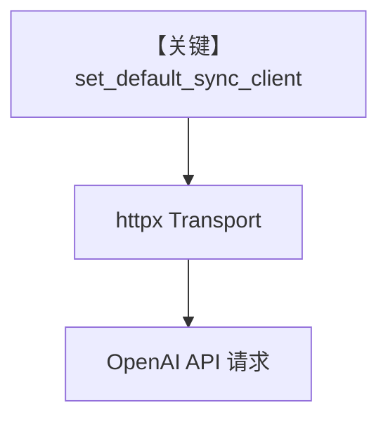

# http_client_caching.py — 实现原理分析

<!-- cookbook-py-source:start -->
## 完整源码

```python
"""
⚙️ Global HTTP Client Customization (Cookbook)

Demonstrates how to define a single global `httpx.Client`
so that all agno Agents (OpenAI, Anthropic, internal models, etc.)
share consistent behavior: logging, headers, request IDs, and retries.

Use cases:
- Company-wide auth headers and tracking
- Unified logging and monitoring
- Production-grade instrumentation

Install:
    uv pip install agno openai httpx
"""

import logging
import uuid
from datetime import datetime

import httpx
from agno.agent import Agent
from agno.models.openai import OpenAIChat
from agno.utils.http import set_default_sync_client

# ---------------------------------------------------------------------------
# Create Agent
# ---------------------------------------------------------------------------

# ----------------------------------------------------------------------------
# Logging Setup
# ----------------------------------------------------------------------------
# use debug so we can see httpx headers
logging.basicConfig(
    level=logging.DEBUG, format="%(asctime)s [%(levelname)s] %(message)s"
)
logger = logging.getLogger("agno.http")

# ----------------------------------------------------------------------------
# Example 1 — Request ID Injection
# ----------------------------------------------------------------------------


class RequestIDTransport(httpx.HTTPTransport):
    """Injects a unique request ID into each outgoing request."""

    def handle_request(self, request: httpx.Request) -> httpx.Response:
        req_id = str(uuid.uuid4())
        request.headers["X-Request-ID"] = req_id
        logger.info(f"[{request.method}] {request.url} (ID={req_id})")

        response = super().handle_request(request)
        logger.info(f"[{response.status_code}] {request.url.host} (ID={req_id})")

        return response


request_id_client = httpx.Client(
    transport=RequestIDTransport(),
    timeout=httpx.Timeout(30.0),
)
set_default_sync_client(request_id_client)

agent = Agent(model=OpenAIChat(id="gpt-5.2"), name="Request-ID Agent")
agent.run("Hello!", stream=False)

# ----------------------------------------------------------------------------
# Example 2 — Global Company Headers
# ----------------------------------------------------------------------------


class HeaderInjectTransport(httpx.HTTPTransport):
    """Adds global company headers and authentication tokens."""

    def __init__(self, headers: dict, **kwargs):
        super().__init__(**kwargs)
        self.headers = headers

    def handle_request(self, request: httpx.Request) -> httpx.Response:
        request.headers.update(self.headers)
        return super().handle_request(request)


company_headers = {
    "X-Company-ID": "agno",
    "X-Service": "agno-agents",
    "X-Environment": "production",
    "X-Version": "1.0.0",
    "X-Timestamp": datetime.now().isoformat(),
}

header_client = httpx.Client(
    transport=HeaderInjectTransport(company_headers),
    timeout=httpx.Timeout(30.0),
)
set_default_sync_client(header_client)

agent = Agent(model=OpenAIChat(id="gpt-5.2"), name="Header Agent")
agent.run("Inject company headers", stream=False)

print("Look at the httpx debug logs to see your headers added!")

# ----------------------------------------------------------------------------
# Example 3 — Production-Ready Combined Transport
# ----------------------------------------------------------------------------


class ProductionTransport(httpx.HTTPTransport):
    """Combines headers, request IDs, and error tracking."""

    def __init__(self, service_name: str, headers: dict):
        super().__init__()
        self.service_name = service_name
        self.headers = headers
        self.counter = 0

    def handle_request(self, request: httpx.Request) -> httpx.Response:
        self.counter += 1
        req_id = str(uuid.uuid4())

        # Inject headers
        request.headers.update(self.headers)
        request.headers.update(
            {
                "X-Service": self.service_name,
                "X-Request-ID": req_id,
                "X-Request-Number": str(self.counter),
            }
        )

        logger.info(
            f"[{self.service_name}] -> {request.url.host} (#{self.counter}, ID={req_id})"
        )

        try:
            response = super().handle_request(request)
            logger.info(
                f"[{self.service_name}] <- {response.status_code} (#{self.counter}, ID={req_id})"
            )
            return response
        except Exception as e:
            logger.error(
                f"[{self.service_name}] ERROR (#{self.counter}, ID={req_id}): {e}"
            )
            raise


prod_client = httpx.Client(
    transport=ProductionTransport("my-ai-app", company_headers),
    timeout=httpx.Timeout(60.0),
)
set_default_sync_client(prod_client)

prod_agents = [
    Agent(model=OpenAIChat(id="gpt-5.2"), name="Prod OpenAI"),
    # Could also run with your own openai compat api, however due to ai.example.com not being a real domain... It will fail
    # Agent(model=OpenAILike(id="gpt-5.2", base_url="https://ai.example.com/v1"), name="Prod Internal"),
]

for agent in prod_agents:
    agent.run(f"Production request via {agent.name}", stream=False)

# ---------------------------------------------------------------------------
# Run Agent
# ---------------------------------------------------------------------------

if __name__ == "__main__":
    pass
```

<!-- cookbook-py-source:end -->

> 源文件：`cookbook/90_models/clients/http_client_caching.py`

## 概述

本示例展示 **`set_default_sync_client`**（`agno.utils.http`）注入全局 **`httpx.Client`**，使 **OpenAIChat** 等模型共用自定义 **Transport**（请求 ID、公司头、生产组合），并打开 **logging.DEBUG** 观察 httpx 行为。

**核心配置一览：**

| 配置项 | 值 | 说明 |
|--------|------|------|
| `model` | `OpenAIChat(id="gpt-5.2")` | 依赖 httpx 的 OpenAI 客户端 |
| `name` | `"Request-ID Agent"` / `"Header Agent"` / `"Prod OpenAI"` | 多段脚本中重复赋值 `agent` |

本文件**不是**单一 Agent 演示，而是**三段**依次 `set_default_sync_client` 并 `agent.run(...)`。

## 核心组件解析

### 全局 httpx 客户端

所有使用默认同步 http 客户端的模型请求会经过当前设置的 `httpx.Client`；后一段示例会**覆盖**前一段的 default client。

### 运行机制与因果链

1. **路径**：`set_default_sync_client` → OpenAI SDK → 共用 Transport。
2. **副作用**：日志侧可观测 header；无 Agent db。
3. **定位**：**可观测性/网关统一头**，与具体模型能力无关。

## System Prompt 组装

各 `Agent` 仅 `model`+`name`（无 instructions）。默认 system 由 `get_system_message` 生成；`name` 默认不进入 system，除非 `add_name_to_context=True`。

### 与 User 消息边界

三段 `run` 的用户消息分别为：`"Hello!"`、`"Inject company headers"`、`"Production request via {agent.name}"`。

### 还原后的完整 System 文本

对每段而言，若无 description/instructions，则主要为 Markdown 段（若 `markdown` 默认 False 则可能无）。请运行时打印。

## 完整 API 请求

```python
# OpenAI Python: chat.completions.create — 底层 httpx 使用 set_default_sync_client 注入的 Client
```

## Mermaid 流程图



## 关键源码文件索引

| 文件 | 关键函数/类 | 作用 |
|------|------------|------|
| `agno/utils/http.py` | `set_default_sync_client` | 全局客户端 |
| `agno/models/openai/chat.py` | OpenAI 客户端构造 | 使用默认 httpx |
