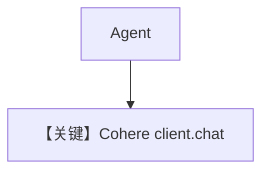

# basic.py — 实现原理分析

> 源文件：`cookbook/90_models/cohere/basic.py`

## 概述

本示例展示 **`Cohere`**（`command-a-03-2025`）与 **cohere SDK `chat()`** 路径（`cohere/chat.py` L222 `self.get_client().chat(...)`）。

**核心配置一览：**

| 配置项 | 值 | 说明 |
|--------|------|------|
| `model` | `Cohere(id="command-a-03-2025")` | Cohere Chat |
| `markdown` | `True` | Markdown |

## 完整 API 请求

```python
# chat.py L222-225: client.chat(model=..., messages=..., **request_kwargs)
```

## System Prompt 组装

### 还原后的完整 System 文本

```text
Use markdown to format your answers.
```

## Mermaid 流程图



## 关键源码文件索引

| 文件 | 关键函数/类 | 作用 |
|------|------------|------|
| `agno/models/cohere/chat.py` | `invoke()` L205–231 | chat |
