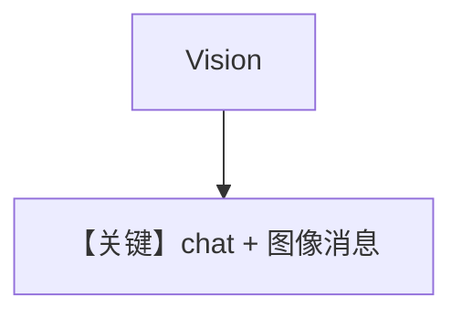

# image_agent.py — 实现原理分析

> 源文件：`cookbook/90_models/cohere/image_agent.py`

## 概述

**Cohere 视觉模型 `c4ai-aya-vision-8b`** + **Image URL**，流式。

**核心配置一览：**

| 配置项 | 值 | 说明 |
|--------|------|------|
| `model` | `Cohere(id="c4ai-aya-vision-8b")` | Vision |
| `markdown` | `True` | Markdown |
| `images` | `Image(url=...)` | 远程图 |

## Mermaid 流程图

## 关键源码文件索引

| 文件 | 关键函数/类 | 作用 |
|------|------------|------|
| `agno/models/cohere/chat.py` | `format_messages` | 多模态 |
