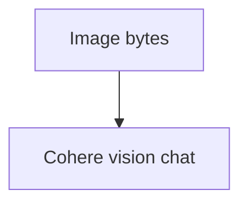

# image_agent_bytes.py — 实现原理分析

> 源文件：`cookbook/90_models/cohere/image_agent_bytes.py`

## 概述

**`from agno.models.cohere.chat import Cohere`** + **Image(content=bytes)**，视觉模型 `c4ai-aya-vision-8b`。

**核心配置一览：**

| 配置项 | 值 | 说明 |
|--------|------|------|
| `model` | `Cohere(id="c4ai-aya-vision-8b")` | Vision |
| `markdown` | `True` | Markdown |
| `images` | `Image(content=image_bytes)` | 字节 |

## System Prompt 组装

### 还原后的完整 System 文本

```text
Use markdown to format your answers.
```

## Mermaid 流程图



## 关键源码文件索引

| 文件 | 关键函数/类 | 作用 |
|------|------------|------|
| `agno/models/cohere/chat.py` | `invoke()` | chat API |
