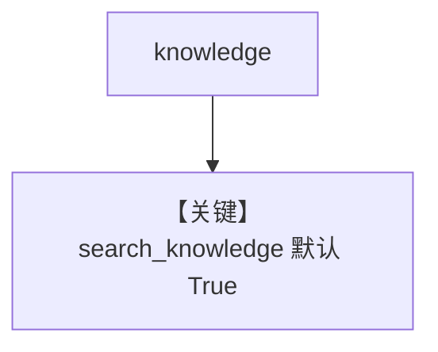

# knowledge.py — 实现原理分析

> 源文件：`cookbook/90_models/cohere/knowledge.py`

## 概述

**Knowledge + PgVector + Cohere(command-a)**，同步 insert PDF。

**核心配置一览：**

| 配置项 | 值 | 说明 |
|--------|------|------|
| `model` | `Cohere(id="command-a-03-2025")` | 生成 |
| `knowledge` | `Knowledge(vector_db=PgVector(...))` | RAG |

## Mermaid 流程图

## 关键源码文件索引

| 文件 | 关键函数/类 | 作用 |
|------|------------|------|
| `agno/agent/_messages.py` | `# 3.3.13` | 知识说明 |
