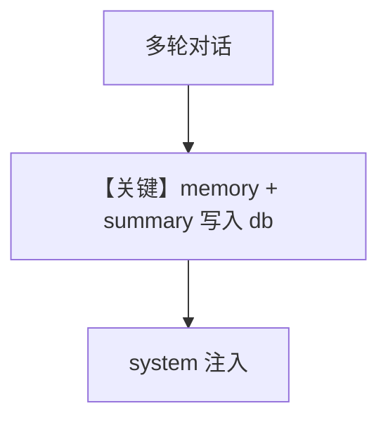

# memory.py — 实现原理分析

> 源文件：`cookbook/90_models/cohere/memory.py`

## 概述

**PostgresDb + Cohere + `update_memory_on_run` + `enable_session_summaries`**，与 anthropic `memory.py` 同模式。

**核心配置一览：**

| 配置项 | 值 | 说明 |
|--------|------|------|
| `model` | `Cohere(id="command-a-03-2025")` | Cohere |
| `db` | `PostgresDb(...)` | 存储 |
| `update_memory_on_run` | `True` | 记忆更新 |
| `enable_session_summaries` | `True` | 摘要 |

## System Prompt 组装

动态记忆/摘要段落；运行时打印 `get_system_message()`。

## Mermaid 流程图

## 关键源码文件索引

| 文件 | 关键函数/类 | 作用 |
|------|------------|------|
| `agno/agent/_messages.py` | `# 3.3.9`–`# 3.3.11` | 记忆与摘要 |
