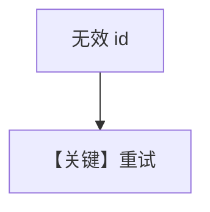

# retry.py — 实现原理分析

<!-- cookbook-py-source:start -->
## 完整源码

```python
"""Example demonstrating how to set up retries with Cohere."""

from agno.agent import Agent
from agno.models.cohere import CohereChat

# ---------------------------------------------------------------------------
# Create Agent
# ---------------------------------------------------------------------------

# We will use a deliberately wrong model ID, to trigger retries.
wrong_model_id = "cohere-wrong-id"

agent = Agent(
    model=CohereChat(
        id=wrong_model_id,
        retries=3,  # Number of times to retry the request.
        delay_between_retries=1,  # Delay between retries in seconds.
        exponential_backoff=True,  # If True, the delay between retries is doubled each time.
    ),
)

agent.print_response("What is the capital of France?")

# ---------------------------------------------------------------------------
# Run Agent
# ---------------------------------------------------------------------------

if __name__ == "__main__":
    pass
```

<!-- cookbook-py-source:end -->

> 源文件：`cookbook/90_models/cohere/retry.py`

## 概述

本示例使用 **`CohereChat`**（非 `Cohere`）+ 错误 id + **retries**。类名与 `cohere/basic.py` 的 `Cohere` 不同，属 Cohere 适配器的另一入口。

**核心配置一览：**

| 配置项 | 值 | 说明 |
|--------|------|------|
| `model` | `CohereChat(id="cohere-wrong-id", retries=3, ...)` | 重试演示 |

## 运行机制与因果链

与同类 retry 示例相同意图；**模型类为 `CohereChat`**，请求路径仍经 `agno.models.cohere` 包内对应 `invoke` 实现。

## Mermaid 流程图



## 关键源码文件索引

| 文件 | 关键函数/类 | 作用 |
|------|------------|------|
| `agno/models/cohere/` | `CohereChat` | 见包内定义 |
