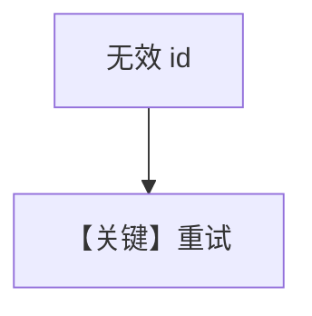

# retry.py — 实现原理分析

> 源文件：`cookbook/90_models/cohere/retry.py`

## 概述

本示例使用 **`CohereChat`**（非 `Cohere`）+ 错误 id + **retries**。类名与 `cohere/basic.py` 的 `Cohere` 不同，属 Cohere 适配器的另一入口。

**核心配置一览：**

| 配置项 | 值 | 说明 |
|--------|------|------|
| `model` | `CohereChat(id="cohere-wrong-id", retries=3, ...)` | 重试演示 |

## 运行机制与因果链

与同类 retry 示例相同意图；**模型类为 `CohereChat`**，请求路径仍经 `agno.models.cohere` 包内对应 `invoke` 实现。

## Mermaid 流程图

## 关键源码文件索引

| 文件 | 关键函数/类 | 作用 |
|------|------------|------|
| `agno/models/cohere/` | `CohereChat` | 见包内定义 |
