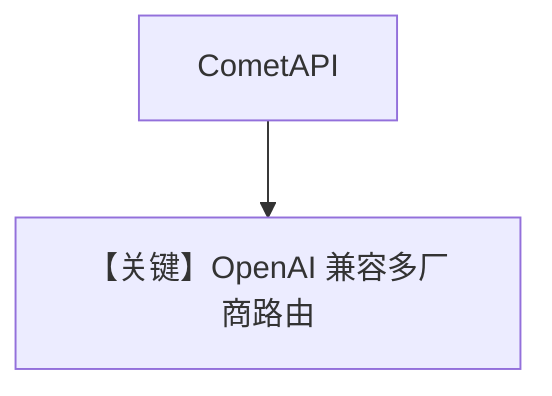

# basic.py — 实现原理分析

> 源文件：`cookbook/90_models/cometapi/basic.py`

## 概述

本示例展示 **`CometAPI`**（继承 **`OpenAILike`**，`base_url` 默认 `https://api.cometapi.com/v1`，API key 为 **`COMETAPI_KEY`**）与 **`gpt-5.2`**，多模式 `print_response` / `aprint_response`。

**核心配置一览：**

| 配置项 | 值 | 说明 |
|--------|------|------|
| `model` | `CometAPI(id="gpt-5.2")` | OpenAI 兼容聚合端点 |
| `markdown` | `True` | Markdown |

## 完整 API 请求

```python
# cometapi.py: OpenAILike → chat.completions.create(..., base_url=..., api_key=COMETAPI_KEY)
```

## System Prompt 组装

### 还原后的完整 System 文本

```text
Use markdown to format your answers.
```

## Mermaid 流程图



## 关键源码文件索引

| 文件 | 关键函数/类 | 作用 |
|------|------------|------|
| `agno/models/cometapi/cometapi.py` | `CometAPI` L13–44 | 认证与 base_url |
| `agno/models/openai/like.py` | `OpenAILike` | invoke |
