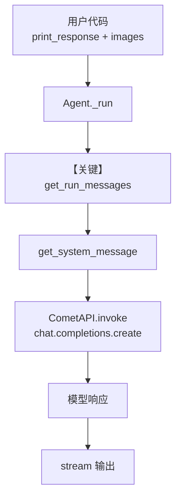

# image_agent.py — 实现原理分析

> 源文件：`cookbook/90_models/cometapi/image_agent.py`

## 概述

本示例展示 Agno 的 **CometAPI + 多模态图像输入** 机制：通过 OpenAI 兼容网关调用视觉模型，将远程图片 URL 随用户消息送入模型。

**核心配置一览：**

| 配置项 | 值 | 说明 |
|--------|------|------|
| `model` | `CometAPI(id="gpt-4o")` | OpenAI 兼容 Chat Completions（`OpenAILike` → `OpenAIChat.invoke`） |
| `markdown` | `True` | 在 system 中追加 Markdown 格式说明 |
| `instructions` | 未设置 | 未设置 |
| `description` | 未设置 | 未设置 |
| `name` / `role` | 未设置 | 未设置 |
| `tools` | 未设置 | 未设置 |
| `db` / `knowledge` | 未设置 | 未设置 |

## 架构分层

```
用户代码层                agno.agent 层
┌──────────────────┐    ┌──────────────────────────────────┐
│ image_agent.py   │    │ Agent.run / print_response       │
│ CometAPI gpt-4o  │───>│ get_run_messages()               │
│ images=[Image(url)]│   │  └ 多模态 user 消息（图像 URL）  │
│                  │    │ get_system_message()             │
│                  │    │  └ 默认 system（含 markdown 段）   │
└──────────────────┘    └──────────────────────────────────┘
                                │
                                ▼
                        ┌──────────────────────┐
                        │ CometAPI (OpenAILike) │
                        │ chat.completions.create │
                        └──────────────────────┘
```

## 核心组件解析

### CometAPI 模型

`CometAPI` 继承 `OpenAILike`，使用 CometAPI 提供的 OpenAI 兼容 `base_url` 与 `COMETAPI_KEY`，请求路径与 `OpenAIChat` 一致（`libs/agno/agno/models/openai/chat.py` 中 `invoke` 调用 `chat.completions.create`）。

### 图像输入

`Image(url=...)` 经消息组装进入 user 侧多模态内容，由模型适配器格式化为提供商所需的消息结构。

### 运行机制与因果链

1. **数据路径**：用户字符串 + `images` → `get_run_messages` → `CometAPI.invoke` → HTTP 响应 → 助手消息；流式时走 `invoke_stream` 分支。
2. **状态与副作用**：无 `db`、无会话持久化；每次运行独立。
3. **关键分支**：`stream=True` 时走流式解析与打印；否则非流式。
4. **与相邻示例差异**：本文件仅演示 CometAPI 上的视觉调用；`image_agent_with_memory.py` 在同目录增加 SQLite 会话记忆。

## System Prompt 组装

| 序号 | 组成部分 | 本文件中的值/来源 | 是否生效 |
|------|---------|-----------------|---------|
| 1 | `system_message` 早退 | 未设置 | 否 |
| 2 | `build_context` | 默认 `True` | 是 |
| 3 | `description` / `role` | 未设置 | 否 |
| 4 | `instructions` | 未设置 | 否 |
| 5 | `markdown` | `True` | 是（`# 3.2.1`，且 `output_schema is None`） |
| 6 | 模型侧 instructions | `model.get_instructions_for_model` 可能追加 | 视模型而定 |

### 拼装顺序与源码锚点

默认路径：`get_system_message()`（`agno/agent/_messages.py`）按注释 `# 3.3.x` 顺序拼接；本示例无自定义 `system_message`，不走早退分支（约 L129-152）。

### 还原后的完整 System 文本

本示例未提供字面量 `instructions`/`description`。静态可确定部分包含 `<additional_information>` 中的 Markdown 提示（见 `# 3.2.1` / `# 3.3.4`）。若需完整字节级内容，可在 `get_system_message` 返回前打印 `Message.content` 核对；若模型注入了 `get_instructions_for_model`，需合并该段。

```text
<additional_information>
- Use markdown to format your answers.
</additional_information>

（以及模型可能注入的指令片段，运行时确定）
```

### 段落释义（模型视角）

- Markdown 段约束助手使用 Markdown，便于终端/`print_response` 展示。
- 用户消息中的图像与文本共同定义任务边界。

### 与 User 消息的边界

System 负责格式与（若有）工具/模型指令；用户消息携带「描述该图」类任务文本及图像引用。

## 完整 API 请求

```python
# CometAPI → OpenAILike → OpenAIChat.invoke（libs/agno/agno/models/openai/chat.py L412-417）
provider_response = client.chat.completions.create(
    model="gpt-4o",
    messages=[
        # system: get_system_message() 产物
        # user: 文本 + 视觉部分（由 _format_message / 多模态工具链生成）
    ],
    # stream=True 时对应流式 API
)
```

> 与第 5 节「还原后的 System 文本」对应：请求中 `messages[0]` 的 `role: system` 内容即该节文本加上模型可能追加的片段。

## Mermaid 流程图



- **【关键】get_run_messages**：把图像与用户问题合并为一次多模态请求。

## 关键源码文件索引

| 文件 | 关键函数/类 | 作用 |
|------|------------|------|
| `agno/models/cometapi/cometapi.py` | `CometAPI` L12-28 | CometAPI 密钥与 base_url |
| `agno/models/openai/chat.py` | `invoke()` L385-417 | Chat Completions 调用 |
| `agno/agent/_messages.py` | `get_system_message()` L106-262 | 默认 system 拼装 |
| `agno/agent/_messages.py` | `get_run_messages()` | 运行期消息列表 |
