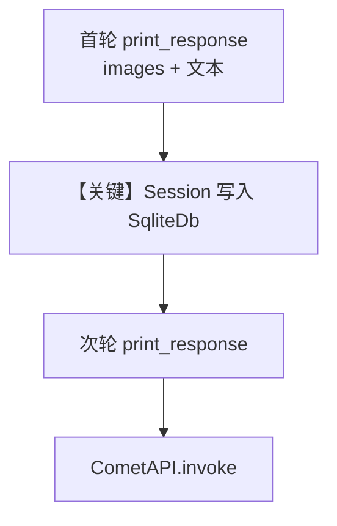

# image_agent_with_memory.py — 实现原理分析

> 源文件：`cookbook/90_models/cometapi/image_agent_with_memory.py`

## 概述

本示例展示 Agno 的 **CometAPI 视觉 + SQLite 会话存储 + 多轮追问** 机制：首轮带图描述，次轮依赖 `db` 持久化的对话历史继续提问。

**核心配置一览：**

| 配置项 | 值 | 说明 |
|--------|------|------|
| `model` | `CometAPI(id="gpt-4o")` | Chat Completions（OpenAI 兼容） |
| `db` | `SqliteDb(db_file="tmp/cometapi_image_agent.db")` | 会话与消息落库（开发用） |
| `session_id` | `"cometapi_image_session"` | 固定会话 id，两轮共享 |
| `markdown` | `True` | Markdown 格式说明进入 system |

## 架构分层

```
用户代码层                agno.agent 层
┌────────────────────────┐    ┌─────────────────────────────────────┐
│ 首轮: 图像 + 描述指令    │───>│ get_run_messages + history 注入      │
│ 次轮: 追问颜色（无新图） │    │ SqliteDb 读写 session               │
└────────────────────────┘    └─────────────────────────────────────┘
                                      │
                                      ▼
                               CometAPI.invoke
```

## 核心组件解析

### 会话与历史

`db` + `session_id` 将会话写入 SQLite，便于跨运行复用同一会话 id。`Agent` 默认 **`add_history_to_context=False`**（`agno/agent/agent.py`）：若不在构造参数中设为 `True`，**不保证**把上一轮 user/assistant 拼进当次请求的 `messages`。若你运行时发现次轮「不记得」图像相关回答，应在 `Agent(...)` 上增加 `add_history_to_context=True`（并可配合 `num_history_runs`）。

检查 agent 默认 add_history - the file doesn't set add_history_to_context. I'll note: 本示例未设置 `add_history_to_context`，若需模型看到上一轮对话，应开启；否则仅演示 API 用法。

### 运行机制与因果链

1. **数据路径**：首轮 user（图+文）→ 模型；次轮 user（纯文本）→ 若历史注入则含首轮 assistant。
2. **副作用**：写入 SQLite `tmp/cometapi_image_agent.db`。
3. **分支**：无工具，无流式（首轮未传 `stream`，次轮默认非流）。
4. **差异**：同目录 `image_agent.py` 无 `db`，无多轮记忆演示。

## System Prompt 组装

与 `image_agent.py` 类似：`markdown=True`，无 `instructions`/`description` 字面量。还原规则同 CometAPI 基础示例。

### 还原后的完整 System 文本

```text
<additional_information>
- Use markdown to format your answers.
</additional_information>
（可能含模型 get_instructions_for_model 片段）
```

## 完整 API 请求

`CometAPI` → `chat.completions.create`；`messages` 含 system 与多轮 user/assistant（若启用历史注入）。

## Mermaid 流程图



## 关键源码文件索引

| 文件 | 关键函数/类 | 作用 |
|------|------------|------|
| `agno/db/sqlite/sqlite.py` | `SqliteDb` | 会话持久化 |
| `agno/agent/_messages.py` | `get_run_messages()` | 历史与当前 user 组装 |
| `agno/models/openai/chat.py` | `invoke()` | Chat Completions |
