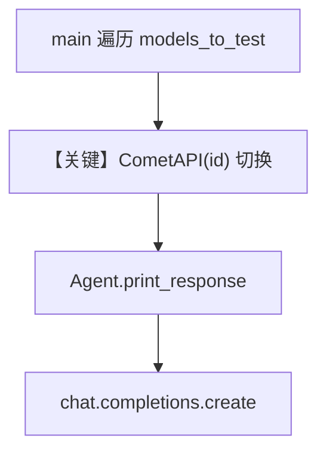

# multi_model.py — 实现原理分析

<!-- cookbook-py-source:start -->
## 完整源码

```python
"""Example showcasing different models available through CometAPI."""

from agno.agent import Agent
from agno.models.cometapi import CometAPI

# ---------------------------------------------------------------------------
# Create Agent
# ---------------------------------------------------------------------------


def test_model(
    model_id: str,
    prompt: str = "Explain what makes you unique as an AI model in 2-3 sentences.",
):
    """Test a specific model with a given prompt."""
    print(f"\nTesting {model_id}:")
    print("=" * 50)

    try:
        agent = Agent(model=CometAPI(id=model_id), markdown=True)
        agent.print_response(prompt)
    except Exception as e:
        print(f"[ERROR] Error with {model_id}: {e}")


def main():
    """Showcase different models available through CometAPI."""
    print("CometAPI Multi-Model Showcase")
    print("This example demonstrates different AI models accessible through CometAPI")

    # Test different model categories
    models_to_test = [
        # OpenAI models
        ("gpt-5.2", "Latest GPT-5 Mini model"),
        # Anthropic models
        ("claude-sonnet-4-20250514", "Claude Sonnet 4"),
        # Google models
        ("gemini-2.5-pro", "Gemini 2.5 Pro"),
        ("gemini-3-flash-preview", "Gemini 3 Flash Preview"),
        # DeepSeek models
        ("deepseek-v3", "DeepSeek V3"),
        ("deepseek-chat", "DeepSeek Chat"),
    ]

    for model_id, description in models_to_test:
        print(f"\n{description}")
        test_model(model_id)

        # Pause between models for readability
        # input("\nPress Enter to continue to the next model...")

    print("\nMulti-model showcase complete!")
    print("Learn more about CometAPI at: https://www.cometapi.com/")


# ---------------------------------------------------------------------------
# Run Agent
# ---------------------------------------------------------------------------

if __name__ == "__main__":
    main()
```

<!-- cookbook-py-source:end -->

> 源文件：`cookbook/90_models/cometapi/multi_model.py`

## 概述

本示例展示通过 **CometAPI 统一网关切换不同厂商 `model_id`** 的方式；脚本在循环中为每个模型构造独立 `Agent` 并调用。

**核心配置一览：**

| 配置项 | 值 | 说明 |
|--------|------|------|
| `model` | `CometAPI(id=<动态>)` | 每次 `test_model` 传入不同 id |
| `markdown` | `True` | 各 Agent 均开启 |
| `instructions` / `description` | 未设置 | 未设置 |

## 架构分层

```
test_model(model_id)     Agent(model=CometAPI(id=model_id))
        │                          │
        └──────────────────────────┴──> print_response(prompt)
```

## 核心组件解析

### 循环内创建 Agent

`test_model` 在 **for 循环内每次新建 `Agent`**。Agno 性能规范建议**在循环外复用 Agent**；本 Cookbook 为演示「多模型 id 切换」可读性而逐模型新建，生产环境应改为单次构造或复用并仅切换 `model.id`（若 API 支持）。

### 运行机制与因果链

1. **数据路径**：`main()` 遍历 `models_to_test` → `test_model` → `CometAPI` → Chat Completions。
2. **副作用**：无持久化 `db`。
3. **分支**：异常时打印 `[ERROR]` 并继续下一模型。
4. **差异**：与单文件单模型示例相比，强调「同一套 Agno 代码多模型 id」。

## System Prompt 组装

各 Agent 均无自定义指令；system 为默认拼装 + Markdown 段（见 `_messages.py` `# 3.2.1`）。

### 还原后的完整 System 文本

同「仅 `markdown=True`」的 CometAPI 基础 case；无额外字面量。

## 完整 API 请求

每次调用等价于：

```python
client.chat.completions.create(model=model_id, messages=[...])  # model_id 如 gpt-5.2、claude-sonnet-4-20250514 等
```

## Mermaid 流程图



## 关键源码文件索引

| 文件 | 关键函数/类 | 作用 |
|------|------------|------|
| `agno/models/cometapi/cometapi.py` | `CometAPI` | 网关与密钥 |
| `agno/models/openai/chat.py` | `invoke()` | 统一 HTTP 调用形态 |
