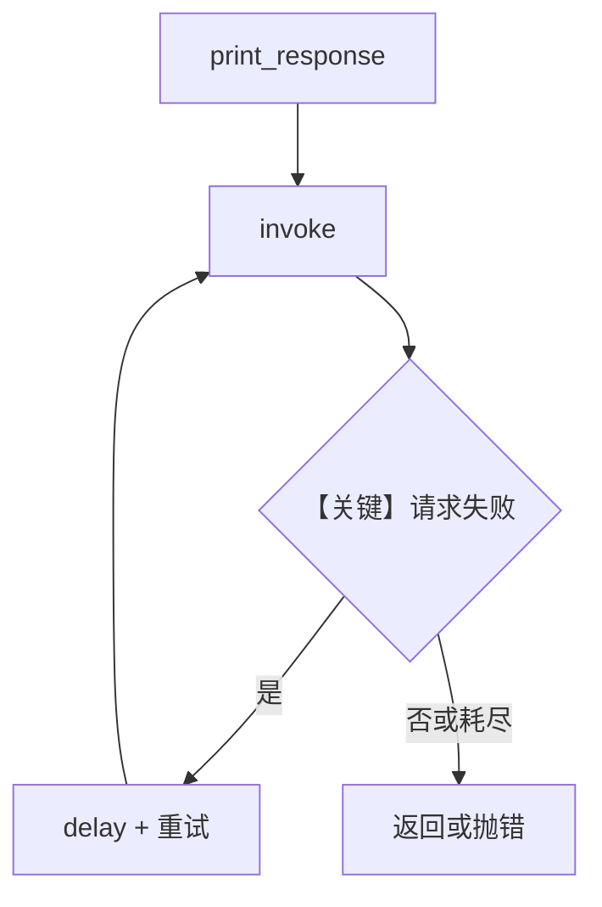

# retry.py — 实现原理分析

> 源文件：`cookbook/90_models/cometapi/retry.py`

## 概述

本示例展示 **CometAPI 模型级重试**：故意使用错误 `id` 触发失败，依赖 `retries`、`delay_between_retries`、`exponential_backoff` 做退避重试。

**核心配置一览：**

| 配置项 | 值 | 说明 |
|--------|------|------|
| `model` | `CometAPI(id="cometapi-wrong-id", retries=3, delay_between_retries=1, exponential_backoff=True)` | 重试与退避在模型实例上配置 |
| `markdown` | 未设置 | 默认 `False` |

## 架构分层

```
wrong_model_id ──> CometAPI 参数 ──> OpenAI 兼容客户端请求
                         │
                         └─> 失败 → 框架/模型层重试逻辑（直至次数耗尽）
```

## 核心组件解析

### 重试参数

重试行为在 `Model` 子类及其 `invoke` 路径中处理（与具体 `retries` 实现位置相关，通常在基类或 OpenAI 兼容封装中）。本示例用于验证「错误 id」时的重试日志与最终错误。

### 运行机制与因果链

1. **数据路径**：单次 user 问题 → 多次失败重试 → 最终错误或成功（实际几乎总失败）。
2. **副作用**：无 db；可能产生多次 outbound HTTP。
3. **分支**：`exponential_backoff=True` 时间隔倍增。
4. **差异**：与同目录 `basic` 类示例相比，聚焦 **可靠性配置**。

## System Prompt 组装

`markdown=False` 且无 `instructions`，默认 system 可能仅含模型侧指令；若 `build_context=True` 且无其它段，正文可能极短。以运行时 `get_system_message()` 为准。

### 还原后的完整 System 文本

无静态字面量 `instructions`/`description`；若需确认，请打印 `get_system_message` 返回值。

## 完整 API 请求

多次等价 `chat.completions.create`（每次重试一次调用），`model="cometapi-wrong-id"`。

## Mermaid 流程图



## 关键源码文件索引

| 文件 | 关键函数/类 | 作用 |
|------|------------|------|
| `agno/models/openai/chat.py` | `invoke()` | 调用链入口 |
| `agno/models/base.py` 或相关 | 重试封装 | 视版本实现重试 |
