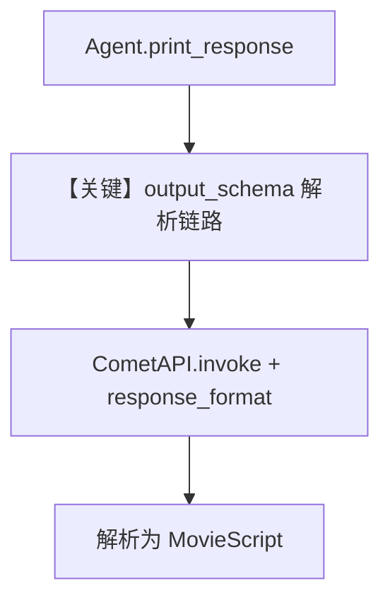

# structured_output.py — 实现原理分析

<!-- cookbook-py-source:start -->
## 完整源码

```python
"""
Cometapi Structured Output
==========================

Cookbook example for `cometapi/structured_output.py`.
"""

from typing import List

from agno.agent import Agent
from agno.models.cometapi import CometAPI
from pydantic import BaseModel, Field

# ---------------------------------------------------------------------------
# Create Agent
# ---------------------------------------------------------------------------


class MovieScript(BaseModel):
    setting: str = Field(..., description="The setting of the movie")
    protagonist: str = Field(..., description="Name of the protagonist")
    antagonist: str = Field(..., description="Name of the antagonist")
    plot: str = Field(..., description="The plot of the movie")
    genre: str = Field(..., description="The genre of the movie")
    scenes: List[str] = Field(..., description="List of scenes in the movie")


agent = Agent(
    model=CometAPI(id="gpt-5.2"),
    description="You help people write movie scripts.",
    output_schema=MovieScript,
    use_json_mode=True,
    markdown=True,
)

agent.print_response("Generate a movie script about a time-traveling detective")

# ---------------------------------------------------------------------------
# Run Agent
# ---------------------------------------------------------------------------

if __name__ == "__main__":
    pass
```

<!-- cookbook-py-source:end -->

> 源文件：`cookbook/90_models/cometapi/structured_output.py`

## 概述

本示例展示 **CometAPI + `output_schema` + `use_json_mode`**：用 Pydantic `MovieScript` 约束返回结构，并启用 JSON 模式以配合结构化解析。

**核心配置一览：**

| 配置项 | 值 | 说明 |
|--------|------|------|
| `model` | `CometAPI(id="gpt-5.2")` | Chat Completions |
| `description` | `"You help people write movie scripts."` | 进入 system（`# 3.3.1`） |
| `output_schema` | `MovieScript` | 结构化输出约束 |
| `use_json_mode` | `True` | JSON 模式请求参数 |
| `markdown` | `True` | 但存在 `output_schema` 时 Markdown 提示被抑制（`# 3.2.1` 条件：`markdown and output_schema is None`） |

## 架构分层

```
description + schema 提示 ──> get_system_message
        │
        └─> get_request_params(response_format=...) ──> CometAPI.invoke
```

## 核心组件解析

### output_schema 与 JSON

`get_system_message` 在 `# 3.3.15` 附近：若模型不支持原生结构化输出，会追加 `get_json_output_prompt(output_schema)`。CometAPI 走 OpenAI 兼容栈，是否原生取决于 `OpenAIChat.get_request_params` 与模型能力位。

### 运行机制与因果链

1. **数据路径**：用户自然语言 → 模型输出 JSON → 解析为 `MovieScript`。
2. **副作用**：无 db。
3. **分支**：`use_json_mode=True` 影响 `response_format`。
4. **差异**：同目录 `tool_use` 用工具而非 schema。

## System Prompt 组装

| 序号 | 组成部分 | 本文件中的值/来源 | 是否生效 |
|------|---------|-----------------|---------|
| 1 | `description` | `You help people write movie scripts.` | 是 |
| 2 | `instructions` | 未设置 | 否 |
| 3 | JSON/schema 提示 | `get_json_output_prompt` 等（动态） | 视模型支持情况而定 |

### 还原后的完整 System 文本

```text
You help people write movie scripts.

（后续为 instructions 段：本示例无自定义 instructions 字面量）

（以及 get_json_output_prompt(MovieScript) 等动态段，需运行时打印确认全文）
```

### 段落释义

- `description` 设定角色为剧本助手。
- Schema 相关段约束字段：`setting`、`protagonist`、`antagonist`、`plot`、`genre`、`scenes`。

## 完整 API 请求

```python
# Chat Completions + response_format（json_object 或 json_schema，依实现）
client.chat.completions.create(
    model="gpt-5.2",
    messages=[{"role": "system", "content": "..."}, {"role": "user", "content": "..."}],
    response_format={...},  # use_json_mode / schema 推导
)
```

## Mermaid 流程图



## 关键源码文件索引

| 文件 | 关键函数/类 | 作用 |
|------|------------|------|
| `agno/agent/_messages.py` | `get_system_message()` L425-439 | JSON/schema 段 |
| `agno/utils/prompts.py` | `get_json_output_prompt` | JSON 说明模板 |
| `agno/models/openai/chat.py` | `get_request_params` | `response_format` |
