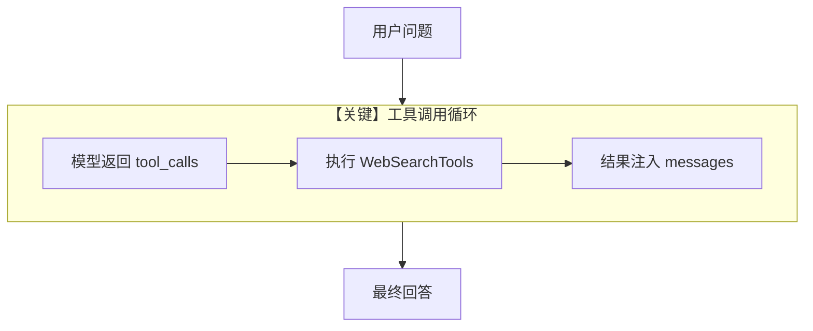

# tool_use.py — 实现原理分析

<!-- cookbook-py-source:start -->
## 完整源码

```python
"""
Cometapi Tool Use
=================

Cookbook example for `cometapi/tool_use.py`.
"""

import asyncio

from agno.agent import Agent
from agno.models.cometapi import CometAPI
from agno.tools.websearch import WebSearchTools

# ---------------------------------------------------------------------------
# Create Agent
# ---------------------------------------------------------------------------

agent = Agent(
    model=CometAPI(id="gpt-5-mini"),
    tools=[WebSearchTools()],
    markdown=True,
)

# Print the response in the terminal

# ---------------------------------------------------------------------------
# Run Agent
# ---------------------------------------------------------------------------
if __name__ == "__main__":
    # --- Sync ---
    agent.print_response("What is the latest price about BTCUSDT on Binance?")

    # --- Sync + Streaming ---
    agent.print_response(
        "What's the current weather in Tokyo and what are some popular tourist attractions there?",
        stream=True,
    )

    # --- Async ---
    asyncio.run(agent.aprint_response("What's the latest news about AI?"))

    # --- Async + Streaming ---
    asyncio.run(
        agent.aprint_response(
            "Search for the latest developments in quantum computing and summarize them",
            stream=True,
        )
    )
```

<!-- cookbook-py-source:end -->

> 源文件：`cookbook/90_models/cometapi/tool_use.py`

## 概述

本示例展示 **CometAPI + WebSearchTools**：在 `gpt-5-mini` 上启用联网搜索工具，并演示同步/异步、流式与非流式调用。

**核心配置一览：**

| 配置项 | 值 | 说明 |
|--------|------|------|
| `model` | `CometAPI(id="gpt-5-mini")` | Chat Completions |
| `tools` | `[WebSearchTools()]` | 工具 schema 注入请求并参与 agent 循环 |
| `markdown` | `True` | Markdown 说明进入 system（无 `output_schema` 时） |

## 架构分层

```
Agent ──> get_tools() ──> chat.completions.create(tools=...)
   │              │
   └──────────────┴──> 工具调用循环（多轮直到模型结束）
```

## 核心组件解析

### WebSearchTools

工具定义经 `get_tools()` 进入模型；模型返回 `tool_calls` 后由框架执行并回注结果。

### 运行机制与因果链

1. **数据路径**：user → 模型 → 可能多轮 tool → 最终自然语言答案。
2. **副作用**：搜索工具可能访问网络；无示例级 db。
3. **分支**：`stream=True` / `aprint_response` 影响输出形态。
4. **差异**：同目录 `structured_output` 无工具，有 schema。

## System Prompt 组装

含 `# 3.3.5` 工具说明段（`_tool_instructions`）及 Markdown 段。

### 还原后的完整 System 文本

静态字面量仅含隐式工具说明与：

```text
<additional_information>
- Use markdown to format your answers.
</additional_information>
```

工具指令正文由框架根据 `WebSearchTools` 生成，需运行时查看完整 system。

## 完整 API 请求

```python
client.chat.completions.create(
    model="gpt-5-mini",
    messages=[...],  # system + user (+ assistant/tool 多轮)
    tools=[...],     # WebSearch 的 JSON schema
    tool_choice=...,
)
```

## Mermaid 流程图



## 关键源码文件索引

| 文件 | 关键函数/类 | 作用 |
|------|------------|------|
| `agno/agent/_tools.py` | `get_tools()` | 工具列表 |
| `agno/models/openai/chat.py` | `invoke()` | 带 tools 的 Completions |
| `agno/agent/_messages.py` | `get_system_message()` L262-265 | 工具指令拼接 |
