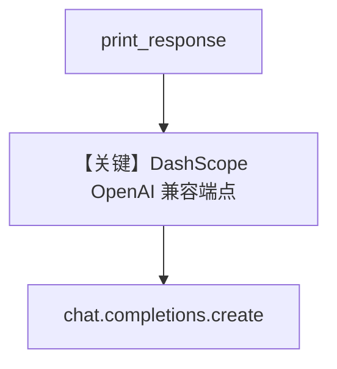

# basic.py — 实现原理分析

> 源文件：`cookbook/90_models/dashscope/basic.py`

## 概述

本示例展示 **DashScope（通义千问 OpenAI 兼容端点）** 的基础用法：`DashScope(id="qwen-plus", temperature=0.5)` 与同步/异步、流式调用。

**核心配置一览：**

| 配置项 | 值 | 说明 |
|--------|------|------|
| `model` | `DashScope(id="qwen-plus", temperature=0.5)` | Chat Completions（`OpenAILike`，`libs/agno/agno/models/dashscope/dashscope.py`） |
| `markdown` | `True` | System 中含 Markdown 格式说明 |

## 架构分层

```
basic.py ──> Agent.print_response / aprint_response
         ──> DashScope.invoke ──> chat.completions.create（OpenAI 兼容）
```

## 核心组件解析

### DashScope

`base_url` 默认为国际兼容模式 `https://dashscope-intl.aliyuncs.com/compatible-mode/v1`，密钥来自 `DASHSCOPE_API_KEY` / `QWEN_API_KEY`。

### 运行机制与因果链

1. **路径**：用户句 → `get_run_messages` → `DashScope.invoke`。
2. **副作用**：无 db。
3. **分支**：`stream=True` 走流式。
4. **差异**：`thinking_agent.py` 打开 `enable_thinking`。

## System Prompt 组装

无 `instructions`/`description` 字面量；`markdown=True` 触发 `# 3.2.1`。

### 还原后的完整 System 文本

```text
<additional_information>
- Use markdown to format your answers.
</additional_information>
```

## 完整 API 请求

```python
# libs/agno/agno/models/openai/chat.py invoke
client.chat.completions.create(model="qwen-plus", messages=[...], temperature=0.5, ...)
```

## Mermaid 流程图



## 关键源码文件索引

| 文件 | 关键函数/类 | 作用 |
|------|------------|------|
| `agno/models/dashscope/dashscope.py` | `DashScope` L12-77 | 端点与 thinking 参数 |
| `agno/models/openai/chat.py` | `invoke()` L385+ | HTTP 调用 |
