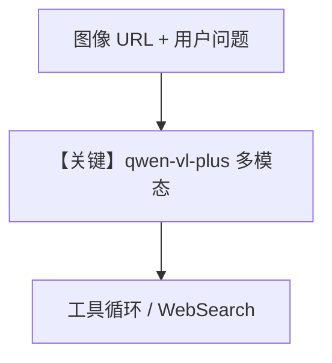

# image_agent.py — 实现原理分析

> 源文件：`cookbook/90_models/dashscope/image_agent.py`

## 概述

本示例展示 **DashScope 视觉模型 `qwen-vl-plus` + WebSearchTools**：图像理解与联网搜索组合。

**核心配置一览：**

| 配置项 | 值 | 说明 |
|--------|------|------|
| `model` | `DashScope(id="qwen-vl-plus")` | 多模态 + Chat Completions |
| `tools` | `[WebSearchTools()]` | 工具调用 |
| `markdown` | `True` | Markdown system 段 |

## 核心组件解析

### 运行机制与因果链

1. **路径**：user 含图像 URL + 文本 → 模型可能调用搜索工具 → 回答。
2. **副作用**：网络搜索；无 db。
3. **分支**：同步流式与 `async` 流式两条演示。

## System Prompt 组装

含工具指令与 Markdown；无自定义 `description`。

## 完整 API 请求

`chat.completions.create`，`messages` 含多模态 user，`tools` 为搜索工具定义。

## Mermaid 流程图

## 关键源码文件索引

| 文件 | 关键函数/类 | 作用 |
|------|------------|------|
| `agno/models/dashscope/dashscope.py` | `DashScope` | Qwen 兼容 API |
| `agno/models/openai/chat.py` | `invoke()` | Completions |
