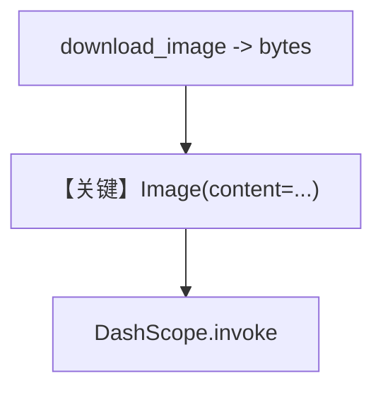

# image_agent_bytes.py — 实现原理分析

<!-- cookbook-py-source:start -->
## 完整源码

```python
"""
Dashscope Image Agent Bytes
===========================

Cookbook example for `dashscope/image_agent_bytes.py`.
"""

from pathlib import Path

from agno.agent import Agent
from agno.media import Image
from agno.models.dashscope import DashScope
from agno.tools.websearch import WebSearchTools
from agno.utils.media import download_image

# ---------------------------------------------------------------------------
# Create Agent
# ---------------------------------------------------------------------------

agent = Agent(
    model=DashScope(id="qwen-vl-plus"),
    tools=[WebSearchTools()],
    markdown=True,
)

image_path = Path(__file__).parent.joinpath("sample.jpg")

download_image(
    url="https://upload.wikimedia.org/wikipedia/commons/a/a7/Camponotus_flavomarginatus_ant.jpg",
    output_path=str(image_path),
)

# Read the image file content as bytes
image_bytes = image_path.read_bytes()

agent.print_response(
    "Analyze this image of an ant. Describe its features, species characteristics, and search for more information about this type of ant.",
    images=[
        Image(content=image_bytes),
    ],
    stream=True,
)

# ---------------------------------------------------------------------------
# Run Agent
# ---------------------------------------------------------------------------

if __name__ == "__main__":
    pass
```

<!-- cookbook-py-source:end -->

> 源文件：`cookbook/90_models/dashscope/image_agent_bytes.py`

## 概述

本示例展示 **本地/下载图像字节** 作为输入：`Image(content=image_bytes)`，模型仍为 `qwen-vl-plus`，并带 `WebSearchTools`。

**核心配置一览：**

| 配置项 | 值 | 说明 |
|--------|------|------|
| `model` | `DashScope(id="qwen-vl-plus")` | 视觉 |
| `tools` | `[WebSearchTools()]` | 搜索 |
| `markdown` | `True` | 默认 system 拼装 |

## 核心组件解析

脚本用 `download_image` 写入 `sample.jpg` 再 `read_bytes()`，避免依赖 URL 直传，适合离线或私有图。

### 运行机制与因果链

与 `image_agent.py`（URL）相对，本示例强调 **bytes 路径** 的媒体封装。

## System Prompt 组装

同带 `markdown` 与工具的默认拼装。

## 完整 API 请求

`chat.completions.create`；user 消息中图像来自字节，由适配器编码为提供商格式。

## Mermaid 流程图



## 关键源码文件索引

| 文件 | 关键函数/类 | 作用 |
|------|------------|------|
| `agno/media/image.py` | `Image` | 承载 bytes |
| `agno/models/openai/chat.py` | `_format_message` 链 | 多模态格式化 |
