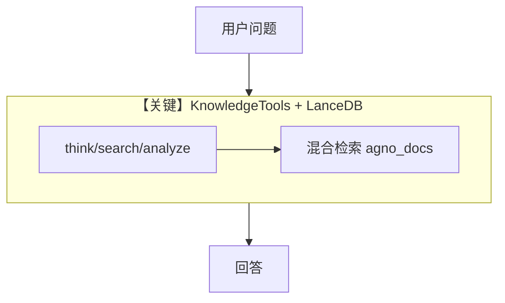

# knowledge_tools.py — 实现原理分析

<!-- cookbook-py-source:start -->
## 完整源码

```python
"""
Here is a tool with reasoning capabilities to allow agents to search and analyze information from a knowledge base.

1. Run: `uv pip install openai agno lancedb tantivy sqlalchemy` to install the dependencies
2. Export your OPENAI_API_KEY
3. Run: `cookbook/92_models/dashscope/knowledge_tools.py` to run the agent
"""

from agno.agent import Agent
from agno.knowledge.embedder.openai import OpenAIEmbedder
from agno.knowledge.knowledge import Knowledge
from agno.models.dashscope import DashScope
from agno.tools.knowledge import KnowledgeTools
from agno.vectordb.lancedb import LanceDb, SearchType

# ---------------------------------------------------------------------------
# Create Agent
# ---------------------------------------------------------------------------

# Create a knowledge containing information from a URL
agno_docs = Knowledge(
    # Use LanceDB as the vector database and store embeddings in the `agno_docs` table
    vector_db=LanceDb(
        uri="tmp/lancedb",
        table_name="agno_docs",
        search_type=SearchType.hybrid,
        embedder=OpenAIEmbedder(id="text-embedding-3-small"),
    ),
)
# Add content to the knowledge
agno_docs.insert(url="https://docs.agno.com/llms-full.txt")

knowledge_tools = KnowledgeTools(
    knowledge=agno_docs,
    enable_think=True,
    enable_search=True,
    enable_analyze=True,
    add_few_shot=True,
)

agent = Agent(
    model=DashScope(id="qwen-plus"),
    tools=[knowledge_tools],
    markdown=True,
)

# ---------------------------------------------------------------------------
# Run Agent
# ---------------------------------------------------------------------------

if __name__ == "__main__":
    agent.print_response(
        "How do I build a team of agents in agno?",
        markdown=True,
        stream=True,
    )
```

<!-- cookbook-py-source:end -->

> 源文件：`cookbook/90_models/dashscope/knowledge_tools.py`

## 概述

本示例展示 **DashScope + Knowledge（LanceDB 混合检索）+ KnowledgeTools**：对 `docs.agno.com` 全文做嵌入索引，由带推理/搜索/分析能力的工具包检索并回答。

**核心配置一览：**

| 配置项 | 值 | 说明 |
|--------|------|------|
| `model` | `DashScope(id="qwen-plus")` | Chat Completions |
| `tools` | `[knowledge_tools]` | `KnowledgeTools(knowledge=..., enable_think=True, ...)` |
| `markdown` | `True` | 默认 system |

## 核心组件解析

### Knowledge + LanceDb

`Knowledge` 使用 `SearchType.hybrid` 与 `OpenAIEmbedder`；`insert(url=...)` 拉取文档并索引。

### KnowledgeTools

`enable_think`、`enable_search`、`enable_analyze`、`add_few_shot` 控制工具行为与提示风格。

### 运行机制与因果链

1. **路径**：用户问题 → 模型调用知识工具 → 向量检索 → 综合回答。
2. **副作用**：写入 `tmp/lancedb`；嵌入调用 OpenAI API（需 `OPENAI_API_KEY`）。
3. **差异**：与仅 `WebSearchTools` 相比，检索范围是自建库而非公网。

## System Prompt 组装

除默认段外，含 **工具说明**（`_tool_instructions`）及 KnowledgeTools 注入的指令。

### 还原后的完整 System 文本

无单一字面量 `instructions`；请运行时打印 system 或查阅 `KnowledgeTools` 生成的工具描述。

## 完整 API 请求

`chat.completions.create` + `tools` 为 KnowledgeTools 暴露的 function definitions。

## Mermaid 流程图



## 关键源码文件索引

| 文件 | 关键函数/类 | 作用 |
|------|------------|------|
| `agno/tools/knowledge.py` | `KnowledgeTools` | 工具封装 |
| `agno/knowledge/knowledge.py` | `Knowledge` | 向量知识库 |
