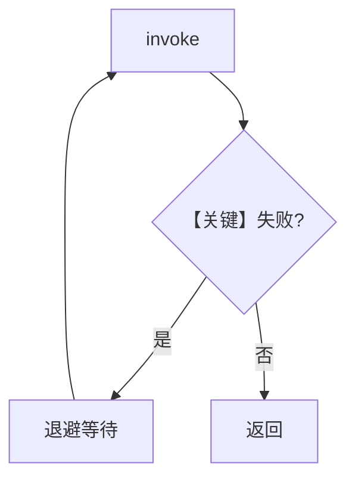

# retry.py — 实现原理分析

> 源文件：`cookbook/90_models/dashscope/retry.py`

## 概述

本示例展示 **DashScope 模型重试配置**：错误 `id` 触发失败与退避重试（`retries=3`、`delay_between_retries=1`、`exponential_backoff=True`）。

**核心配置一览：**

| 配置项 | 值 | 说明 |
|--------|------|------|
| `model` | `DashScope(id="dashscope-wrong-id", retries=3, delay_between_retries=1, exponential_backoff=True)` | 重试参数在模型实例上 |

## 核心组件解析

与 CometAPI/Fireworks 等同系列 retry cookbook 一致，差异仅在 `DashScope` 端点与 env（`DASHSCOPE_API_KEY`）。

## System Prompt 组装

无额外字面量；`markdown` 未设，默认 `False`。

## 完整 API 请求

多次 `chat.completions.create` 尝试，直至成功或耗尽。

## Mermaid 流程图

## 关键源码文件索引

| 文件 | 关键函数/类 | 作用 |
|------|------------|------|
| `agno/models/dashscope/dashscope.py` | `DashScope` | Qwen 兼容客户端 |
| `agno/models/openai/chat.py` | `invoke()` | 请求入口 |
