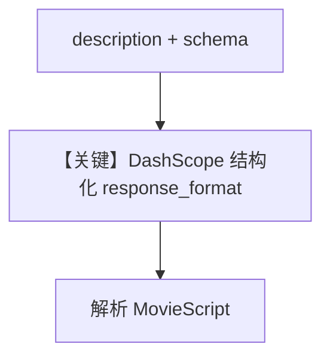

# structured_output.py — 实现原理分析

> 源文件：`cookbook/90_models/dashscope/structured_output.py`

## 概述

本示例展示 **DashScope + `output_schema`**：`MovieScript` Pydantic 模型约束输出；`description` 提供角色说明。未设置 `use_json_mode`（由框架与 `DashScope.supports_native_structured_outputs` 等决定 JSON/schema 路径）。

**核心配置一览：**

| 配置项 | 值 | 说明 |
|--------|------|------|
| `model` | `DashScope(id="qwen-plus")` | 支持原生结构化相关标志见 `dashscope.py` L38-40 |
| `description` | `You write movie scripts and return them as structured JSON data.` | `# 3.3.1` |
| `output_schema` | `MovieScript` | 结构化输出 |
| `markdown` | 未设置 | 默认 `False`；且存在 `output_schema` 时不加 Markdown 提示 |

## 核心组件解析

`get_system_message` 中 `# 3.3.15`-`# 3.3.16` 处理 JSON/schema 提示；DashScope 声明 `supports_native_structured_outputs: bool = True`，可能走原生 JSON schema 分支而非长文本 `get_json_output_prompt`。

## System Prompt 组装

### 还原后的完整 System 文本

```text
You write movie scripts and return them as structured JSON data.

（若未走原生 schema，则附加 get_json_output_prompt 等动态段）
```

## 完整 API 请求

OpenAI 兼容 `chat.completions.create`，带 `response_format` 或等价参数（依 `get_request_params`）。

## Mermaid 流程图



## 关键源码文件索引

| 文件 | 关键函数/类 | 作用 |
|------|------------|------|
| `agno/models/dashscope/dashscope.py` | `supports_native_structured_outputs` | 能力位 |
| `agno/agent/_messages.py` | `# 3.3.15` | JSON 提示分支 |
