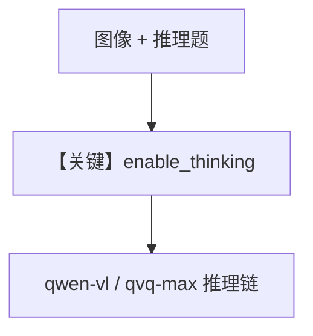

# thinking_agent.py — 实现原理分析

<!-- cookbook-py-source:start -->
## 完整源码

```python
"""
Dashscope Thinking Agent
========================

Cookbook example for `dashscope/thinking_agent.py`.
"""

from agno.agent import Agent
from agno.media import Image
from agno.models.dashscope import DashScope

# ---------------------------------------------------------------------------
# Create Agent
# ---------------------------------------------------------------------------

agent = Agent(
    model=DashScope(id="qvq-max", enable_thinking=True),
)

image_url = "https://img.alicdn.com/imgextra/i1/O1CN01gDEY8M1W114Hi3XcN_!!6000000002727-0-tps-1024-406.jpg"

agent.print_response(
    "How do I solve this problem? Please think through each step carefully.",
    images=[Image(url=image_url)],
    stream=True,
)

# ---------------------------------------------------------------------------
# Run Agent
# ---------------------------------------------------------------------------

if __name__ == "__main__":
    pass
```

<!-- cookbook-py-source:end -->

> 源文件：`cookbook/90_models/dashscope/thinking_agent.py`

## 概述

本示例展示 **DashScope 思考模式**：`enable_thinking=True` 与视觉输入（`qvq-max` + `Image(url=...)`），用于复杂推理题。

**核心配置一览：**

| 配置项 | 值 | 说明 |
|--------|------|------|
| `model` | `DashScope(id="qvq-max", enable_thinking=True)` | `get_request_params` 合并 thinking（`dashscope.py` L70+） |
| `markdown` | 未设置 | 默认 `False` |

## 核心组件解析

`DashScope` 将 `enable_thinking` / `include_thoughts` / `thinking_budget` 传入提供商请求体。

## System Prompt 组装

无自定义 `instructions`；以默认 system 为准。

## 完整 API 请求

`chat.completions.create`，额外包含 DashScope 原生 thinking 参数。

## Mermaid 流程图



## 关键源码文件索引

| 文件 | 关键函数/类 | 作用 |
|------|------------|------|
| `agno/models/dashscope/dashscope.py` | `get_request_params()` L70+ | thinking 参数 |
