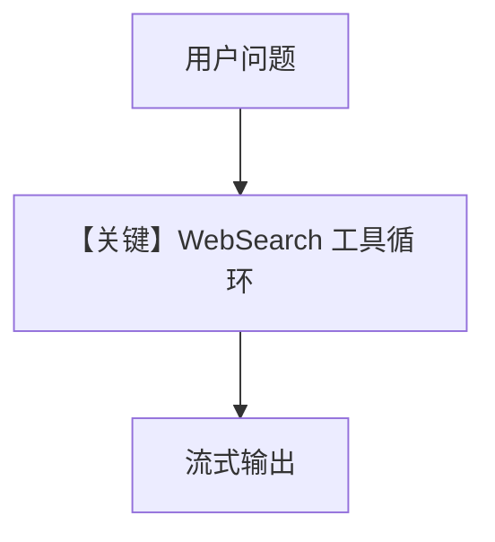

# tool_use.py — 实现原理分析

<!-- cookbook-py-source:start -->
## 完整源码

```python
"""
Dashscope Tool Use
==================

Cookbook example for `dashscope/tool_use.py`.
"""

import asyncio

from agno.agent import Agent
from agno.models.dashscope import DashScope
from agno.tools.websearch import WebSearchTools

# ---------------------------------------------------------------------------
# Create Agent
# ---------------------------------------------------------------------------

agent = Agent(
    model=DashScope(id="qwen-plus"),
    tools=[WebSearchTools()],
    markdown=True,
)

# ---------------------------------------------------------------------------
# Run Agent
# ---------------------------------------------------------------------------
if __name__ == "__main__":
    # --- Sync + Streaming ---
    agent.print_response("What's happening in AI today?", stream=True)

    # --- Async + Streaming ---
    async def main():
        await agent.aprint_response(
            "What's the latest news about artificial intelligence?", stream=True
        )

    asyncio.run(main())
```

<!-- cookbook-py-source:end -->

> 源文件：`cookbook/90_models/dashscope/tool_use.py`

## 概述

本示例展示 **DashScope `qwen-plus` + WebSearchTools**，同步流式与异步流式调用。

**核心配置一览：**

| 配置项 | 值 | 说明 |
|--------|------|------|
| `model` | `DashScope(id="qwen-plus")` | Chat Completions |
| `tools` | `[WebSearchTools()]` | 联网搜索 |
| `markdown` | `True` | Markdown system 段 |

## 核心组件解析

典型 agentic 工具循环；无额外状态。

## System Prompt 组装

工具指令 + Markdown（`# 3.2.1`）。

## 完整 API 请求

`client.chat.completions.create(model="qwen-plus", messages=[...], tools=[...])`。

## Mermaid 流程图



## 关键源码文件索引

| 文件 | 关键函数/类 | 作用 |
|------|------------|------|
| `agno/tools/websearch.py` | `WebSearchTools` | 搜索工具 |
| `agno/models/openai/chat.py` | `invoke()` | Completions |
